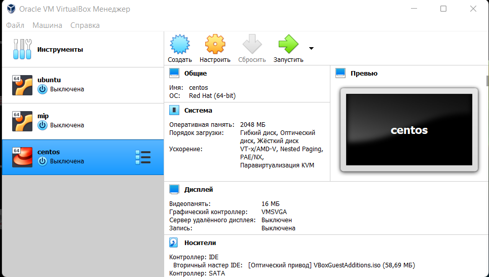

---
# Front matter
lang: ru-RU
title: Защита лабораторной работы №1. Установка и конфигурация операционной системы на виртуальную машину
author: "Смородова Дарья Владимировна"
group: НФИбд-01-19
institute: RUDN University, Moscow, Russian Federation
date: 2022 Sep 10th

# Formatting
toc: false
slide_level: 2
theme: metropolis
header-includes: 
 - \metroset{progressbar=frametitle,sectionpage=progressbar,numbering=fraction}
 - '\makeatletter'
 - '\beamer@ignorenonframefalse'
 - '\makeatother'
aspectratio: 43
section-titles: true

---

# Цель выполнения лабораторной работы 

Приобретение практических навыков установки операционной системы на виртуальную машину, настройки минимально необходимых для дальнейшей работы сервисов.

# Задачи лабораторной работы  

1. Установить операционную систему Linux c дистрибутивом Rocky на вирутальную машину VirtualBox;

2. Настроить необходимые для работы сервисы.

3. Узнать информацию о системе при помощи команды dmesg.

# Результаты выполнения лабораторной работы

# Создание виртуальной машины

{ #fig:001 width=70% }

## Объем оперативной памяти

{ #fig:002 width=70% }

## Новый жесткий диск

{ #fig:003 width=70% }

## Тип диска 

{ #fig:004 width=70% }

## Формат хранения диска

{ #fig:005 width=70% }

## Размер и расположение диска

{ #fig:006 width=70% }

## Установка образа диска

{ #fig:007 width=70% }

## Информация о виртуальной машине

{ #fig:008 width=70% }

## Запуск виртуальной машины

{ #fig:009 width=70% }

## Установка языка

{ #fig:010 width=70% }

## Выбор программ

{ #fig:011 width=70% }

## Отключение KDUMP

{ #fig:012 width=70% }

## Место установки

{ #fig:013 width=70% }

## Настройка сети и имени узла

{ #fig:014 width=70% }

## Установка пароля для root

{ #fig:015 width=70% }

## Создание пользователя

{ #fig:016 width=70% }

## Драйвера

{ #fig:018 width=70% }

## Драйвера

{ #fig:019 width=70% }

# Просмотр информации

## Версия ядра Linux

{ #fig:022 width=70% }

## Частота процессора

{ #fig:023 width=70% }

## Модель процессора

{ #fig:024 width=70% }

## Объем доступной оперативной памяти

{ #fig:025 width=70% }

## Тип обнаруженного гипервизора

{ #fig:026 width=70% }

## Тип файловой системы корневого раздела

{ #fig:028 width=70% }

# Вывод   

В ходе данной лабораторной работы, мы приобрели практические навыки установки операционной системы на виртуальную машину и настройки минимально необходимых для дальнейшей работы сервисов.

