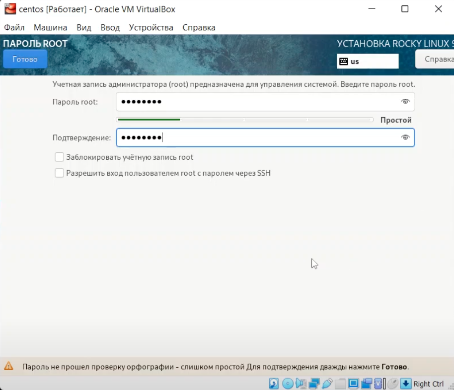
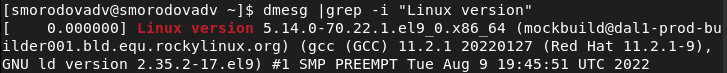

---
# Front matter
title: "Лабораторная работа №1"
subtitle: "Установка и конфигурация операционной системы на виртуальную машину"
author: "Смородова Дарья Владимировна"
group: НФИбд-01-19
institute: RUDN University, Moscow, Russian Federation
date: 2022 Sep 10th

# Generic otions
lang: ru-RU
toc-title: "Содержание"

# Bibliography
bibliography: bib/cite.bib
csl: pandoc/csl/gost-r-7-0-5-2008-numeric.csl

# Pdf output format
toc: true # Table of contents
toc_depth: 2
lof: true # List of figures
lot: true # List of tables
fontsize: 12pt
linestretch: 1.5
papersize: a4
documentclass: scrreprt
### Fonts
mainfont: PT Serif
romanfont: PT Serif
sansfont: PT Sans
monofont: PT Mono
mainfontoptions: Ligatures=TeX
romanfontoptions: Ligatures=TeX
sansfontoptions: Ligatures=TeX,Scale=MatchLowercase
monofontoptions: Scale=MatchLowercase,Scale=0.9
## Biblatex
biblatex: true
biblio-style: "gost-numeric"
biblatexoptions:
- parentracker=true
- backend=biber
- hyperref=auto
- language=auto
- autolang=other*
- citestyle=gost-numeric
## Misc options
indent: true
header-includes:
- \linepenalty=10 # the penalty added to the badness of each line within a paragraph (no associated penalty node) Increasing the value makes tex try to have fewer lines in the paragraph.
- \interlinepenalty=0 # value of the penalty (node) added after each line of a paragraph.
- \hyphenpenalty=50 # the penalty for line breaking at an automatically inserted hyphen
- \exhyphenpenalty=50 # the penalty for line breaking at an explicit hyphen
- \binoppenalty=700 # the penalty for breaking a line at a binary operator
- \relpenalty=500 # the penalty for breaking a line at a relation
- \clubpenalty=150 # extra penalty for breaking after first line of a paragraph
- \widowpenalty=150 # extra penalty for breaking before last line of a paragraph
- \displaywidowpenalty=50 # extra penalty for breaking before last line before a display math
- \brokenpenalty=100 # extra penalty for page breaking after a hyphenated line
- \predisplaypenalty=10000 # penalty for breaking before a display
- \postdisplaypenalty=0 # penalty for breaking after a display
- \floatingpenalty = 20000 # penalty for splitting an insertion (can only be split footnote in standard LaTeX)
- \raggedbottom # or \flushbottom
- \usepackage{float} # keep figures where there are in the text
- \floatplacement{figure}{H} # keep figures where there are in the text
---

# Цель работы

Приобретение практических навыков установки операционной системы на виртуальную машину, настройки минимально необходимых для дальнейшей работы сервисов.

# Задание

1. Установить операционную систему Linux c дистрибутивом Rocky на вирутальную машину VirtualBox;

2. Настроить необходимые для работы сервисы.

3. Узнать информацию о системе при помощи команды dmesg.

# Теоретическое введение  

Linux — это семейство операционных систем (ОС), работающих на основе одноименного ядра. 

Линус Торвальдс — первый разработчик и создатель Linux. Именно в честь него и была названа ОС. В 1981 году Линус начал работу над собственной ОС семейства Unix. Через три года появилась первая версия, доступная для скачивания. [^3]

Дистрибутив — форма распространения программного обеспечения.

Rocky Linux - это корпоративная операционная система с открытым исходным кодом, разработанная для 100% совместимости с Red Hat Enterprise Linux (RHEL). Rocky Linux собирает исходные тексты непосредственно из RHEL. [^2]

Операционная система CentOS (сокращенно от английского «Community ENTerprise Operating System») — дистрибутив Linux, основанный на коммерческом дистрибутиве Red Hat Enterprise Linux компании Red Hat, который предназначен для корпоративного использования. [^4]

# Выполнение лабораторной работы

1. Откроем VirtualBox и начнем создание виртуальной машины с операционной сисемой Linux.

2. Зададим имя машины и тип операционной системы (рис. [-@fig:001]):

{ #fig:001 width=70% }

3. Укажем размер основной памяти виртуальной машины — 2048 МБ (рис. [-@fig:002]):

{ #fig:002 width=70% }

4. Создадим новый виртуальный жесткий диск и зададим конфигурацию жесткого диска — загрузочный, VDI (VirtualBox 
Disk Image), динамический виртуальный диск. Зададим размер диска — 20 ГБ и его расположение (рис. [-@fig:003] - [-@fig:006]):

{ #fig:003 width=70% }

{ #fig:004 width=70% }

{ #fig:005 width=70% }

{ #fig:006 width=70% }

5. Подключим образ оптического диска (рис. [-@fig:007]):

{ #fig:007 width=70% }

6. Посмотрим данные виртуальной машины (рис. [-@fig:008]):

{ #fig:008 width=70% }

7. Запустим виртуальную машину (рис. [-@fig:009]):

{ #fig:009 width=70% }

8. Установим русскоязычный интерфейс (рис. [-@fig:010]):

{ #fig:010 width=70% }

9. Установим сервер с GUI и средства разработки (рис. [-@fig:011]):

{ #fig:011 width=70% }

10. Отключим KDUMP (рис. [-@fig:012]):

{ #fig:012 width=70% }

11. Выберем место установки (рис. [-@fig:013]):

{ #fig:013 width=70% }

12. Настроим сеть и укажем «smorodovadv.localdomain» в качестве имени узла (рис. [-@fig:014]):

{ #fig:014 width=70% }

13. Установим пароль для root (рис. [-@fig:015]):

{ #fig:015 width=70% }

14. Создадим пользователя с правами администратора (рис. [-@fig:016]):

{ #fig:016 width=70% }

15. Завершим установку ОС (рис. [-@fig:017]):

{ #fig:017 width=70% }

16. Установим необходимые драйвера (рис. [-@fig:018] - [-@fig:019]):

{ #fig:018 width=70% }

{ #fig:019 width=70% }

17. Посмотрим всю информацию при помощи команды dmesg (рис. [-@fig:020]):

{ #fig:020 width=70% }

18. Посмотрим всю информацию при помощи команды dmesg | less (рис. [-@fig:021]):

{ #fig:021 width=70% }

19. С помощью команды grep -i " " получим:

   - Версию ядра Linux (Linux version)(рис. [-@fig:022]):

      { #fig:022 width=70% }

   - Частоту процессора (Detected Mhz processor) (рис. [-@fig:023]):

      { #fig:023 width=70% }

   - Модель процессора (CPU0)(рис. [-@fig:024]):

      { #fig:024 width=70% }

   - Объем доступной оперативной памяти (Memory available)(рис. [-@fig:025]):

      { #fig:025 width=70% }

   - Тип обнаруженного гипервизора (Hypervisor detected) (рис. [-@fig:026]):

       { #fig:026 width=70% }

   - Тип файловой системы корневого раздела (рис. [-@fig:027]):

      { #fig:027 width=70% }

   - Последовательность монтирования файловых систем (рис. [-@fig:028]):

      { #fig:028 width=70% }

# Контрольные вопросы[^1]

1. Какую информацию содержит учётная запись пользователя?
      Учётная запись, как правило, содержит сведения, необходимые для опознания пользователя при подключении к системе, сведения для авторизации и учёта. Это идентификатор пользователя (login) и его пароль. Пароль или его аналог, как правило, хранится в зашифрованном или хэшированном виде для обеспечения его безопасности.

2. Укажите команды терминала и приведите примеры:  
   - для получения справки по команде:  
     Чтобы получить справку по команде, введите man перед ней, например, man bash выдаст руководство по терминалу.  
   
   - для перемещения по файловой системе:  
      Чтобы перемещаться ао файловой системе использкют команду cd, например cd/user/Загрузки.  
   
   - для просмотра содержимого каталога:  
     Команда ls позволяет просмотреть содержимое каталога.  
   
   - для определения объёма каталога:  
      Чтобы посмотреть объем каталога используют команду du -s,
      например du -s /home/user/Загрузки.  
   
   - для создания / удаления каталогов / файлов:  
      Чтобы создать каталог используется команда rmdir, а для 
      создания mkdir, для удаления файла rm, а для создания файла touch.  
   
   - для задания определённых прав на файл / каталог:  
      Для задания определенных прав на файл/каталог используют
      команду chmod.  
   
   - для просмотра истории команд:  
      Чтобы посмотреть историю команд используют команду history,
      например history -c очищает историю команд.  
   
3. Что такое файловая система? Приведите примеры с краткой характеристикой.
   Файловая система – это инструмент, позволяющий операционной системе и программам обращаться к нужным файлам и работать с ними. При этом программы оперируют только названием файла, его размером и датой созданий. Все остальные функции по поиску необходимого файла в хранилище и работе с ним берет на себя файловая система накопителя. 

   Файловых систем довольно много. Но рядовым пользователям с операционной системой Windows на десктопном ПК знакомы только две.

   - FAT – одна из старейших файловых систем, которая была разработана еще в 1977 году программистами компании Microsoft для гибких дисков. Современная версия FAT32 вышла в 1995 году. Она может работать с томами размером до 32 ГБ и файлами размером до 4 ГБ. При этом система не работает с накопителями объемом более 8 Тб. Поэтому сегодня FAT32 используется в основном только на флешках, картах памяти фотоаппаратов и музыкальных плееров.

   - NTFS, или новая технология файловой системы была создана, чтоб устранить недостатки FAT32. Структура системы хранения данных имеет вид бинарного дерева. В отличие от иерархической, как у FAT32, доступ к информации осуществляется по запросу, а поиск ведется по названию файла. При этом система имеет каталог, отсортированный по названиям. Массив делится на 2 части и отсекается та, в которой данного файла не будет, оставшаяся часть также делиться на 2, и так далее до тех пор, пока не будет найден нужный файл. В отличие от предыдущей файловой системы, NTFS может работать с томами объемом 8 ПБ (1 петабайт – 1015 байт), и оперировать более чем 4 миллиардами файлов.

   -  На мобильных устройствах с ОС Android используется файловая система ext2/ext4, но только в установленном накопителе. Съемные карты памяти работают на системе FAT32.

4. Как посмотреть, какие файловые системы подмонтированы в ОС?
      Чтобы посмотреть какие файловые системы уже смонтированы в системе можно выполнить команду mount без параметров или выполнить команду df -a. Также можно посмотреть содержимое файла /etc/mtab. Команда mount при монтировании новой файловой системы добавляет в этот файл строку с информацией о добавляемой системе. А команда umount соответственно удаляет строку касающуюся отмонтированного раздела.  

5. Как удалить зависший процесс?
    Чтобы убить зависший процесс нужно использовать команду kill.
   
# Выводы  
В ходе данной лабораторной работы, мы приобрели практические навыки установки операционной системы на виртуальную машину и настройки минимально необходимых для дальнейшей работы сервисов.

# Список литературы

1. [Методические материалы к лабораторной работе, представленные на сайте "ТУИС РУДН"](https://esystem.rudn.ru/)

2. [Rocky Linux](https://rockylinux.org/ru/)

3. [Linux](https://ru.wikipedia.org/wiki/Linux)

4. [CentOS Linux](https://ru.wikipedia.org/wiki/CentOS)

[^1]: Методические материалы к лабораторной работе

[^2]: Rocky Linux

[^3]: Linux

[^4]: CentOS Linux