---
# Front matter
lang: ru-RU
title: Защита лабораторной работы №2. Дискреционное разграничение прав в Linux. Основные атрибуты
author: "Смородова Дарья Владимировна"
group: НФИбд-01-19
institute: RUDN University, Moscow, Russian Federation
date: 2022 Sep 16th

# Formatting
toc: false
slide_level: 2
theme: metropolis
header-includes: 
 - \metroset{progressbar=frametitle,sectionpage=progressbar,numbering=fraction}
 - '\makeatletter'
 - '\beamer@ignorenonframefalse'
 - '\makeatother'
aspectratio: 43
section-titles: true

---

# Цель выполнения лабораторной работы 

Получение практических навыков работы в консоли с атрибутами файлов, закрепление теоретических основ дискреционного разграничения доступа в современных системах с открытым кодом на базе ОС Linux.

# Результаты выполнения лабораторной работы

## Создание пользователя guest

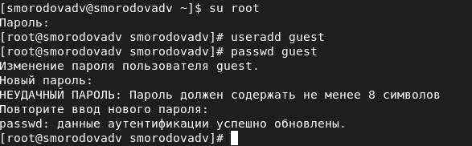{ #fig:001 width=70% }

## Создание пользователя guest

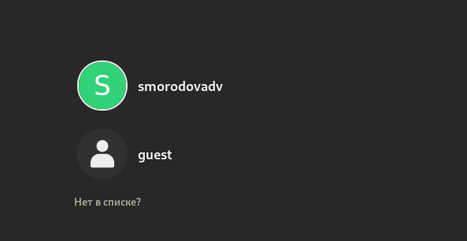{ #fig:002 width=70% }

## Проверка директории

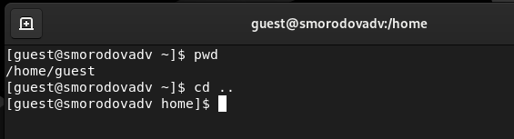{ #fig:003 width=70% }

## Уточнение имени пользователя

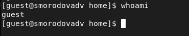{ #fig:004 width=70% }

## Проверка ID

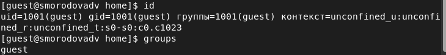{ #fig:005 width=70% }

## Файл /etc/passwd

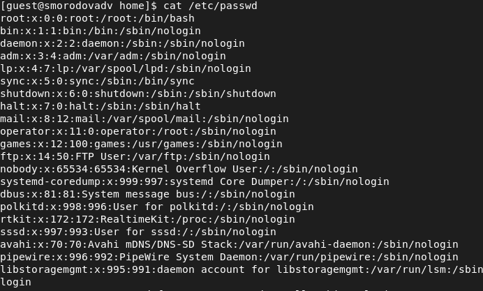{ #fig:006 width=70% }

## Существующие директории

{ #fig:008 width=70% }

## Расширенные атрибуты поддиректорий

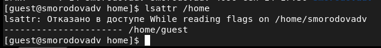{ #fig:009 width=70% }

## Создание поддиректории dir1

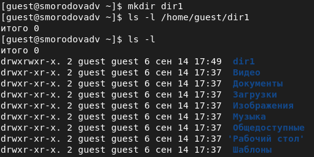{ #fig:010 width=70% }

## Просмотр расширенных атрибутов поддиректорий 

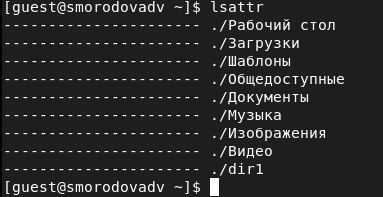{ #fig:011 width=70% }

## Снятие с директорий всех атрибутов

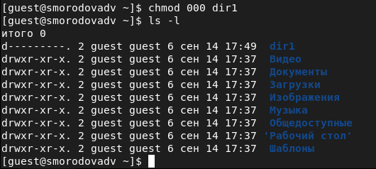{ #fig:012 width=70% }

## Попытка создать файл в директории dir1

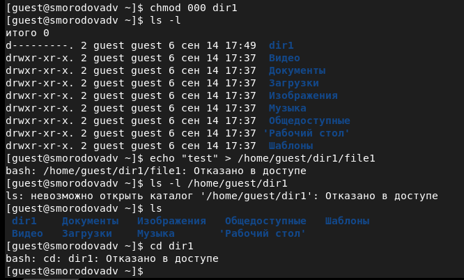{ #fig:013 width=70% }

## Проверка установленных прав и разрешенных действий

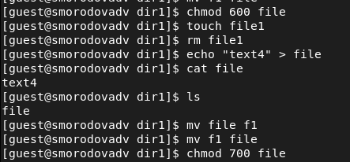{ #fig:014 width=70% }

## Установленные права и разрешённые действия 1

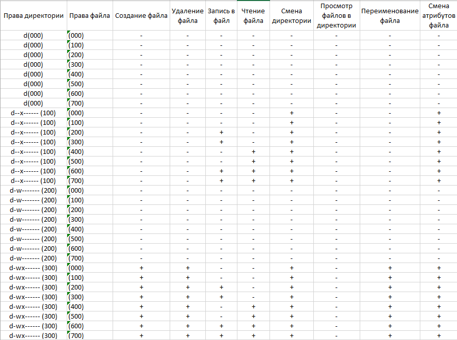{ #fig:015 width=70% }

## Установленные права и разрешённые действия 2

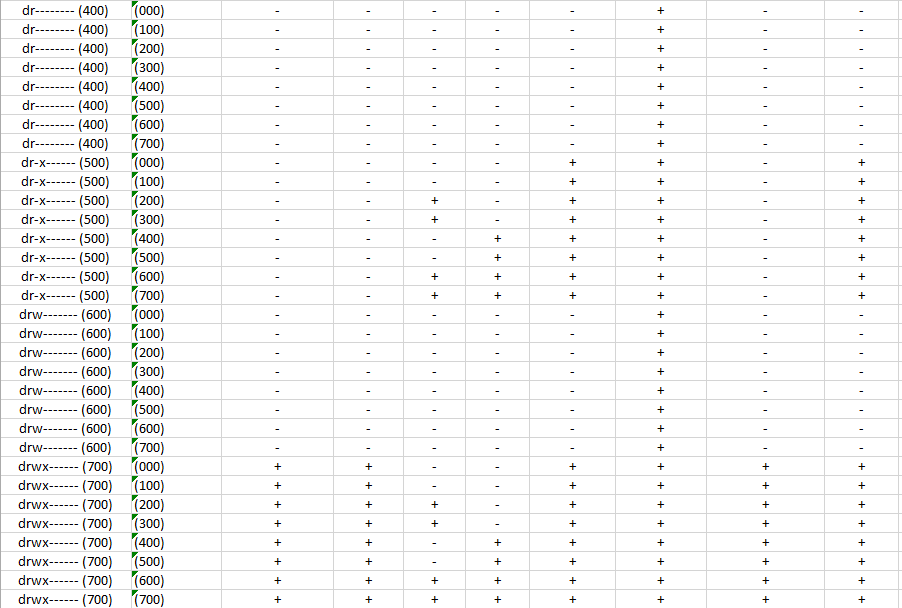{ #fig:016 width=70% }

## Минимальные права для совершения операций

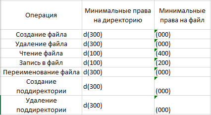{ #fig:017 width=70% }

# Выводы   

В ходе данной лабораторной работы, мы получили практические навыки работы в консоли с атрибутами файлов, закрепили теоретические основы дискреционного разграничения доступа в современных системах с открытым кодом на базе ОС Linux.

