---
# Front matter
lang: ru-RU
title: Защита лабораторной работы №3. Дискреционное разграничение прав в Linux. Два пользователя
author: "Смородова Дарья Владимировна"
group: НФИбд-01-19
institute: RUDN University, Moscow, Russian Federation
date: 2022 Sep 22nd

# Formatting
toc: false
slide_level: 2
theme: metropolis
header-includes: 
 - \metroset{progressbar=frametitle,sectionpage=progressbar,numbering=fraction}
 - '\makeatletter'
 - '\beamer@ignorenonframefalse'
 - '\makeatother'
aspectratio: 43
section-titles: true

---

# Цель выполнения лабораторной работы 

Получение практических навыков работы в консоли с атрибутами файлов для групп пользователей.

# Результаты выполнения лабораторной работы

## Создание пользователя guest2

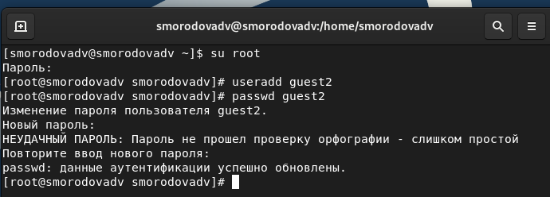{ #fig:001 width=70% }

## Добавление пользователя guest2 в группу guest

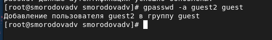{ #fig:002 width=70% }

## Вход в систему от двух пользователей

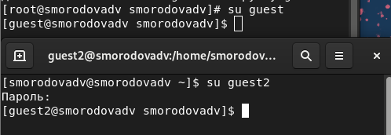{ #fig:003 width=70% }

## Определение директории

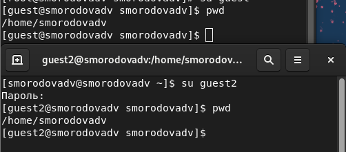{ #fig:004 width=70% }

## Проверка ID

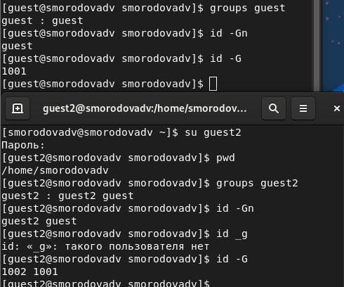{ #fig:005 width=70% }

## Файл /etc/passwd

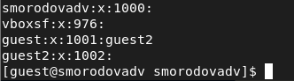{ #fig:007 width=70% }

## Регистрация пользователя guest2 в группе guest

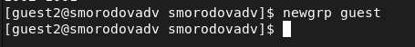{ #fig:008 width=70% }

## Изменение прав директории 

{ #fig:009 width=70% }

## Проверка правильности снятия атрибутов

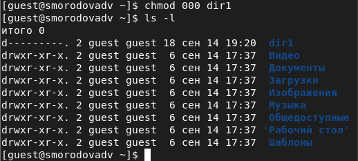{ #fig:010 width=70% }

## Установленные права и разрешённые действия для групп 1

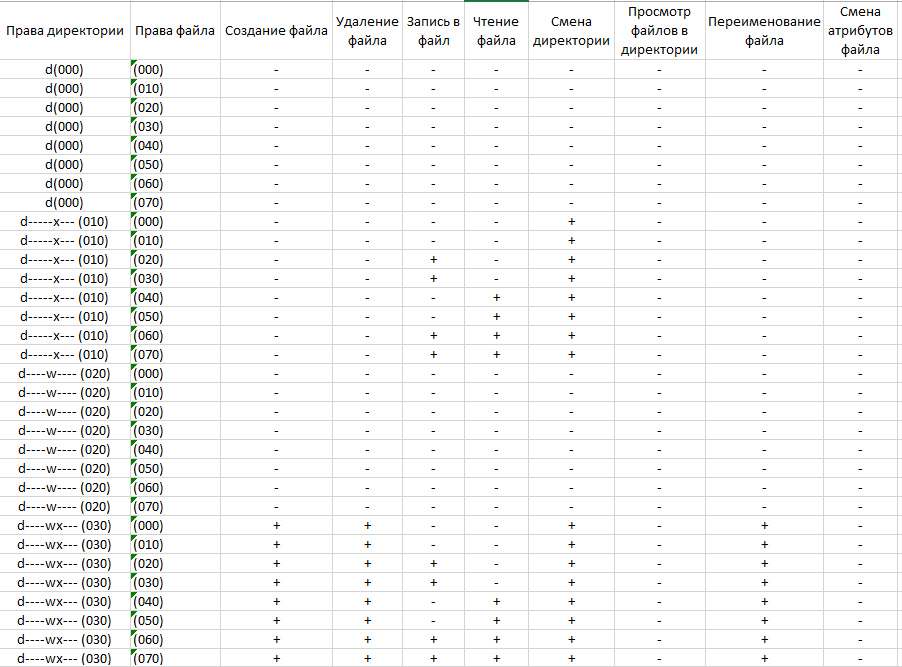{ #fig:011 width=70% }

## Установленные права и разрешённые действия для групп 2

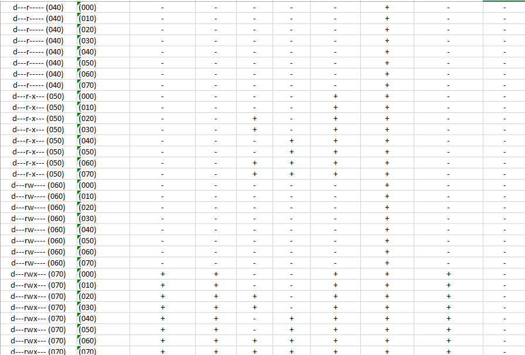{ #fig:012 width=70% }

## Минимальные права для совершения операций от имени пользователей входящих в группу

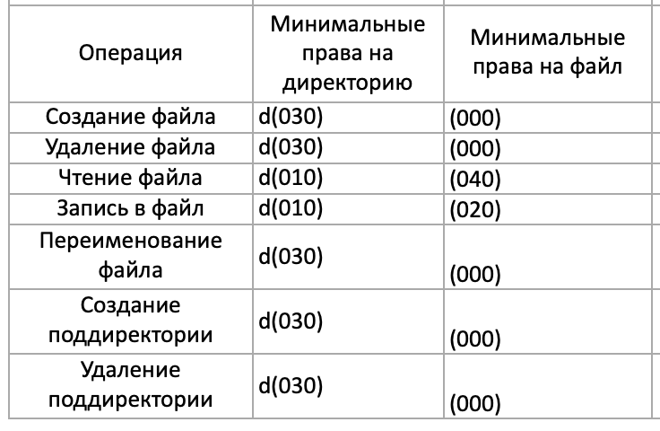{ #fig:013 width=70% }

# Выводы   

В ходе данной лабораторной работы, мы получили практические навыки работы в консоли с атрибутами файлов для групп пользователей.

