---
# Front matter
title: "Лабораторная работа 3"
subtitle: "Дискреционное разграничение прав в Linux. Два пользователя"
author: "Смородова Дарья Владимировна"
group: НФИбд-01-19
institute: RUDN University, Moscow, Russian Federation
date: 2022 Sep 22nd

# Generic otions
lang: ru-RU
toc-title: "Содержание"

# Bibliography
bibliography: bib/cite.bib
csl: pandoc/csl/gost-r-7-0-5-2008-numeric.csl

# Pdf output format
toc: true # Table of contents
toc_depth: 2
lof: true # List of figures
lot: true # List of tables
fontsize: 12pt
linestretch: 1.5
papersize: a4
documentclass: scrreprt
### Fonts
mainfont: PT Serif
romanfont: PT Serif
sansfont: PT Sans
monofont: PT Mono
mainfontoptions: Ligatures=TeX
romanfontoptions: Ligatures=TeX
sansfontoptions: Ligatures=TeX,Scale=MatchLowercase
monofontoptions: Scale=MatchLowercase,Scale=0.9
## Biblatex
biblatex: true
biblio-style: "gost-numeric"
biblatexoptions:
- parentracker=true
- backend=biber
- hyperref=auto
- language=auto
- autolang=other*
- citestyle=gost-numeric
## Misc options
indent: true
header-includes:
- \linepenalty=10 # the penalty added to the badness of each line within a paragraph (no associated penalty node) Increasing the value makes tex try to have fewer lines in the paragraph.
- \interlinepenalty=0 # value of the penalty (node) added after each line of a paragraph.
- \hyphenpenalty=50 # the penalty for line breaking at an automatically inserted hyphen
- \exhyphenpenalty=50 # the penalty for line breaking at an explicit hyphen
- \binoppenalty=700 # the penalty for breaking a line at a binary operator
- \relpenalty=500 # the penalty for breaking a line at a relation
- \clubpenalty=150 # extra penalty for breaking after first line of a paragraph
- \widowpenalty=150 # extra penalty for breaking before last line of a paragraph
- \displaywidowpenalty=50 # extra penalty for breaking before last line before a display math
- \brokenpenalty=100 # extra penalty for page breaking after a hyphenated line
- \predisplaypenalty=10000 # penalty for breaking before a display
- \postdisplaypenalty=0 # penalty for breaking after a display
- \floatingpenalty = 20000 # penalty for splitting an insertion (can only be split footnote in standard LaTeX)
- \raggedbottom # or \flushbottom
- \usepackage{float} # keep figures where there are in the text
- \floatplacement{figure}{H} # keep figures where there are in the text
---

# Цель работы

Получение практических навыков работы в консоли с атрибутами файлов для групп пользователей.

# Теоретическое введение  

В операционной системе Linux есть много отличных функций безопасности, но она из самых важных - это система прав доступа к файлам. Linux, как последователь идеологии ядра Linux в отличие от Windows, изначально проектировался как многопользовательская система, поэтому права доступа к файлам в linux продуманы очень хорошо.

Изначально каждый файл имеет три параметра доступа:

   - Чтение - разрешает получать содержимое файла, но на запись нет. Для каталога позволяет получить список файлов и каталогов, расположенных в нем;

   - Запись - разрешает записывать новые данные в файл или изменять существующие, а также позволяет создавать и изменять файлы и каталоги;

   - Выполнение - вы не можете выполнить программу, если у нее нет флага выполнения. Этот атрибут устанавливается для всех программ и скриптов, именно с помощью него система может понять, что этот файл нужно запускать как программу.

Но все эти права были бы бессмысленными, если бы применялись сразу для всех пользователей. Поэтому каждый файл имеет три категории пользователей, для которых можно устанавливать различные сочетания прав доступа:

   - Владелец - набор прав для владельца файла, пользователя, который его создал или сейчас установлен его владельцем. Обычно владелец имеет все права, чтение, запись и выполнение.

   - Группа - любая группа пользователей, существующая в системе и привязанная к файлу. Но это может быть только одна группа и обычно это группа владельца, хотя для файла можно назначить и другую группу.

   - Остальные - все пользователи, кроме владельца и пользователей, входящих в группу файла.

Именно с помощью этих наборов полномочий устанавливаются права файлов в linux. Каждый пользователь может получить полный доступ только к файлам, владельцем которых он является или к тем, доступ к которым ему разрешен. Только пользователь Root может работать со всеми файлами независимо от их набора их полномочий. [^2]

# Выполнение лабораторной работы [^1]

1. В установленной операционной системе уже была создана учётная запись пользователя guest (используя учётную запись администратора) и был задан пароль для неё.

2. Аналогичным образом создаем второго пользователя guest2 (рис. [-@fig:001]):

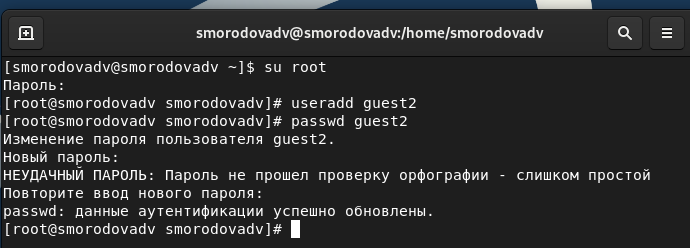{ #fig:001 width=70% }

3. Добавим пользователя guest2 в группу guest при помощи команды gpasswd -a guest2 guest (рис. [-@fig:002]):

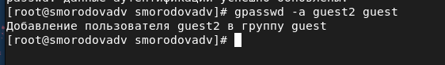{ #fig:002 width=70% }

4. Осуществим вход в систему от двух пользователей на двух разных консолях: guest на первой консоли и guest2 на второй консоли (рис. [-@fig:003]):

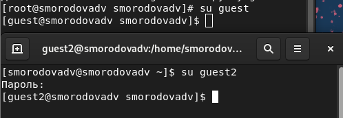{ #fig:003 width=70% }

5. Для обоих пользователей командой pwd определим директорию, в которой мы находимся (рис. [-@fig:004]):

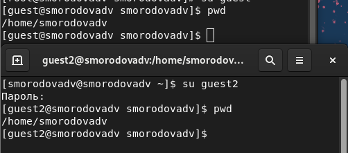{ #fig:004 width=70% }

6. Уточнимимя вашего пользователя, его группу, кто входит в неё и к каким группам принадлежит он сам. Определим командами groups guest и groups guest2, в какие группы входят пользователи guest и guest2. Сравним вывод команды groups с выводом команд id -Gn и id -G. Данные при этих выводах совпадают (рис. [-@fig:005]):

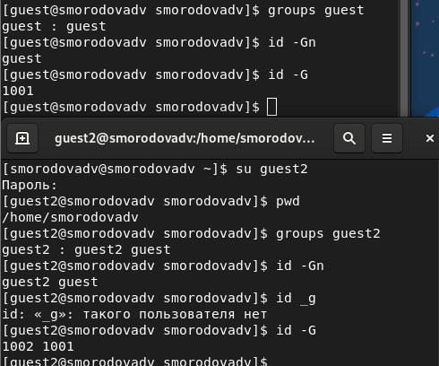{ #fig:005 width=70% }

7. Посмторим файл /etc/passwd (рис. [-@fig:006] - [-@fig:007]):

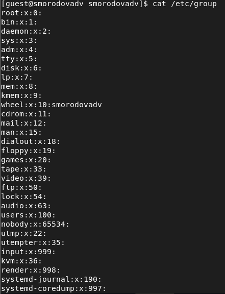{ #fig:006 width=70% }

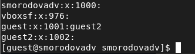{ #fig:007 width=70% }

8. От имени пользователя guest2 выполним регистрацию пользователя guest2 в группе guest командой newgrp guest (рис. [-@fig:008]):

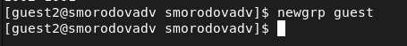{ #fig:008 width=70% }

9. От имени пользователя guest изменим права директории /home/guest, разрешив все действия для пользователей группы при помощи команды chmod g+rwx /home/guest (рис. [-@fig:009]):

{ #fig:009 width=70% }

10. Проверим правильность снятия атрибутов [-@fig:010]):

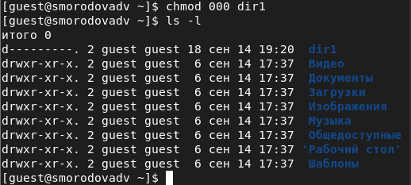{ #fig:010 width=70% }

11. Заполним таблицу «Установленные права и разрешённые действия для групп», меняя атрибуты у директории dir1 и файла file1 от имени пользователя guest и делая проверку от пользователя guest2,
определив опытным путём, какие операции разрешены, а какие нет. Если
операция разрешена, занесем в таблицу знак «+», если не разрешена – знак «-».

12. Получившаяся таблица «Установленные права и разрешённые действия для групп»(рис. [-@fig:011] - [-@fig:012]):

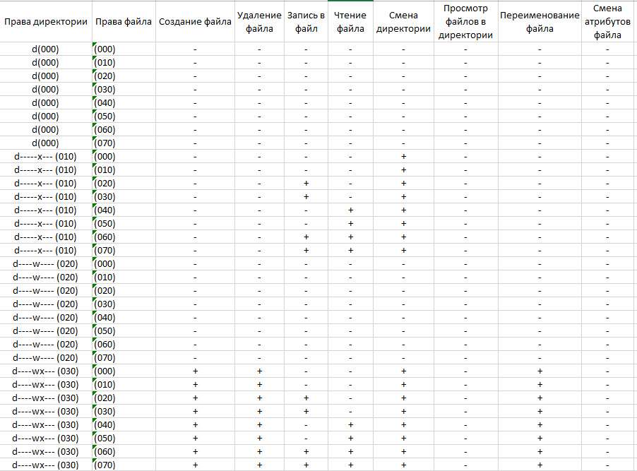{ #fig:011 width=70% }

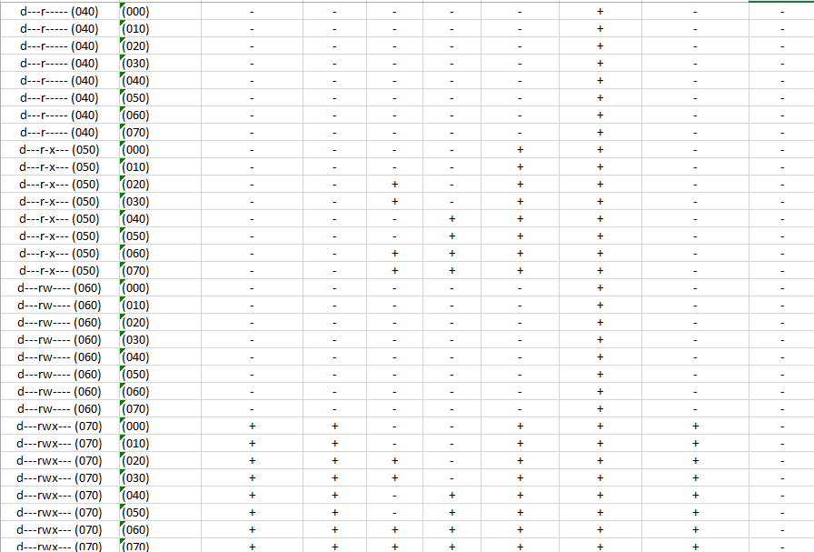{ #fig:012 width=70% }

13. Главное отличие между таблицами в лабораторной работе №2 и этой таблицей в том, что в предыдущей таблице смена атрибутов файла возможна при любых правах директории и файла, а в таблице в лабораторной работе №3 смена атрибутов файла невозможна ни при каких правах.

14. На основании заполненной таблицы определим те или иные минимально необходимые права для выполнения пользователем guest2 операций внутри директории dir1, заполним таблицу «Минимальные права для совершения операций от имени пользователей входящих в группу» (рис. [-@fig:013]):

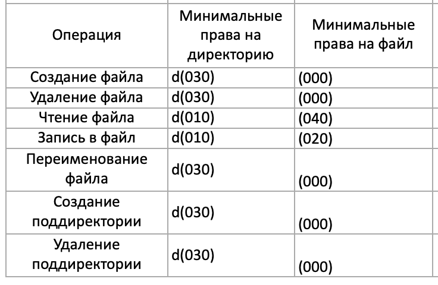{ #fig:013 width=70% }

# Выводы  
В ходе данной лабораторной работы, мы получили практические навыки работы в консоли с атрибутами файлов для групп пользователей.

# Список литературы

1. [Методические материалы к лабораторной работе, представленные на сайте "ТУИС РУДН"](https://esystem.rudn.ru/)

2. [Права доступа к файлам в Linux](https://losst.ru/prava-dostupa-k-fajlam-v-linux)

[^1]: Методические материалы к лабораторной работе

[^2]: Права доступа к файлам в Linux