---
# Front matter
lang: ru-RU
title: Защита лабораторной работы №4. Дискреционное разграничение прав в Linux. Расширенные атрибуты
author: "Смородова Дарья Владимировна"
group: НФИбд-01-19
institute: RUDN University, Moscow, Russian Federation
date: 2022 Sep 30th

# Formatting
toc: false
slide_level: 2
theme: metropolis
header-includes: 
 - \metroset{progressbar=frametitle,sectionpage=progressbar,numbering=fraction}
 - '\makeatletter'
 - '\beamer@ignorenonframefalse'
 - '\makeatother'
aspectratio: 43
section-titles: true

---

# Цель выполнения лабораторной работы 

Получение практических навыков работы в консоли с расширенными атрибутами файлов.

# Результаты выполнения лабораторной работы

## Определение расширенных атрибутов файла

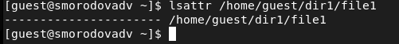{ #fig:001 width=70% }

## Установка прав на чтение и запись для владельца файла

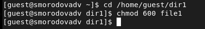{ #fig:002 width=70% }

## Попытка установить расширенный атрибут

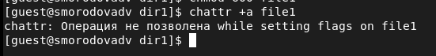{ #fig:003 width=70% }

## Попытка установить расширенный атрибут с правами  администратора

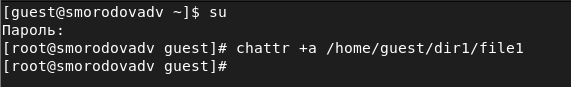{ #fig:004 width=70% }

## Проверка правильности установления атрибута

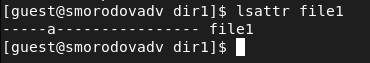{ #fig:005 width=70% }

## Дозапись в файл file1 слова «test»

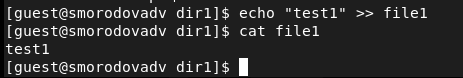{ #fig:006 width=70% }

## Попытка удалить файл file1 и стереть имеющуюся в нём информацию

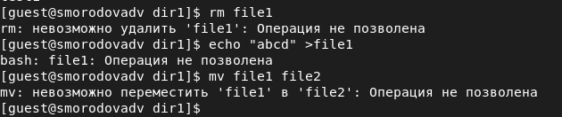{ #fig:007 width=70% }

## Попытка  установить на файл file1 права

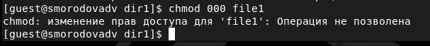{ #fig:008 width=70% }

## Снятие расширенного атрибута

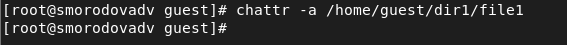{ #fig:009 width=70% }

## Повтор операций]

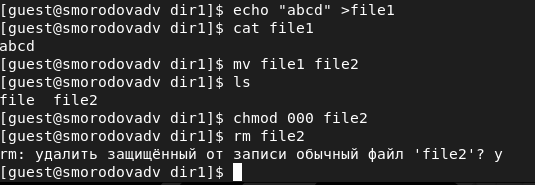{ #fig:010 width=70% }

## Установка расширенного атрибута «i»

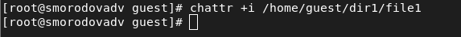{ #fig:011 width=70% }

## Проверка выполнения

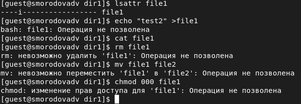{ #fig:012 width=70% }

# Выводы   

- Повысили свои навыки использования интерфейса командой строки (CLI);

- Познакомились на примерах с тем, как используются основные и расширенные атрибуты при разграничении доступа;

- Имели возможность связать теорию дискреционного разделения доступа (дискреционная политика безопасности) с её реализацией на практике в ОС Linux;

- Опробовали действие на практике расширенных атрибутов «а» и «i».
