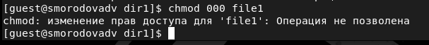

---
# Front matter
title: "Лабораторная работа №4"
subtitle: "Дискреционное разграничение прав в Linux. Расширенные атрибуты"
author: "Смородова Дарья Владимировна"
group: НФИбд-01-19
institute: RUDN University, Moscow, Russian Federation
date: 2022 Sep 30th

# Generic otions
lang: ru-RU
toc-title: "Содержание"

# Bibliography
bibliography: bib/cite.bib
csl: pandoc/csl/gost-r-7-0-5-2008-numeric.csl

# Pdf output format
toc: true # Table of contents
toc_depth: 2
lof: true # List of figures
lot: true # List of tables
fontsize: 12pt
linestretch: 1.5
papersize: a4
documentclass: scrreprt
### Fonts
mainfont: PT Serif
romanfont: PT Serif
sansfont: PT Sans
monofont: PT Mono
mainfontoptions: Ligatures=TeX
romanfontoptions: Ligatures=TeX
sansfontoptions: Ligatures=TeX,Scale=MatchLowercase
monofontoptions: Scale=MatchLowercase,Scale=0.9
## Biblatex
biblatex: true
biblio-style: "gost-numeric"
biblatexoptions:
- parentracker=true
- backend=biber
- hyperref=auto
- language=auto
- autolang=other*
- citestyle=gost-numeric
## Misc options
indent: true
header-includes:
- \linepenalty=10 # the penalty added to the badness of each line within a paragraph (no associated penalty node) Increasing the value makes tex try to have fewer lines in the paragraph.
- \interlinepenalty=0 # value of the penalty (node) added after each line of a paragraph.
- \hyphenpenalty=50 # the penalty for line breaking at an automatically inserted hyphen
- \exhyphenpenalty=50 # the penalty for line breaking at an explicit hyphen
- \binoppenalty=700 # the penalty for breaking a line at a binary operator
- \relpenalty=500 # the penalty for breaking a line at a relation
- \clubpenalty=150 # extra penalty for breaking after first line of a paragraph
- \widowpenalty=150 # extra penalty for breaking before last line of a paragraph
- \displaywidowpenalty=50 # extra penalty for breaking before last line before a display math
- \brokenpenalty=100 # extra penalty for page breaking after a hyphenated line
- \predisplaypenalty=10000 # penalty for breaking before a display
- \postdisplaypenalty=0 # penalty for breaking after a display
- \floatingpenalty = 20000 # penalty for splitting an insertion (can only be split footnote in standard LaTeX)
- \raggedbottom # or \flushbottom
- \usepackage{float} # keep figures where there are in the text
- \floatplacement{figure}{H} # keep figures where there are in the text
---

# Цель работы

Получение практических навыков работы в консоли с расширенными атрибутами файлов.

# Теоретическое введение  

В операционной системе Linux есть много отличных функций безопасности, но она из самых важных - это система прав доступа к файлам. Linux, как последователь идеологии ядра Linux в отличие от Windows, изначально проектировался как многопользовательская система, поэтому права доступа к файлам в linux продуманы очень хорошо.

Изначально каждый файл имеет три параметра доступа:

   - Чтение - разрешает получать содержимое файла, но на запись нет. Для каталога позволяет получить список файлов и каталогов, расположенных в нем;

   - Запись - разрешает записывать новые данные в файл или изменять существующие, а также позволяет создавать и изменять файлы и каталоги;

   - Выполнение - вы не можете выполнить программу, если у нее нет флага выполнения. Этот атрибут устанавливается для всех программ и скриптов, именно с помощью него система может понять, что этот файл нужно запускать как программу.

Но все эти права были бы бессмысленными, если бы применялись сразу для всех пользователей. Поэтому каждый файл имеет три категории пользователей, для которых можно устанавливать различные сочетания прав доступа:

   - Владелец - набор прав для владельца файла, пользователя, который его создал или сейчас установлен его владельцем. Обычно владелец имеет все права, чтение, запись и выполнение.

   - Группа - любая группа пользователей, существующая в системе и привязанная к файлу. Но это может быть только одна группа и обычно это группа владельца, хотя для файла можно назначить и другую группу.

   - Остальные - все пользователи, кроме владельца и пользователей, входящих в группу файла.

Именно с помощью этих наборов полномочий устанавливаются права файлов в linux. Каждый пользователь может получить полный доступ только к файлам, владельцем которых он является или к тем, доступ к которым ему разрешен. Только пользователь Root может работать со всеми файлами независимо от их набора их полномочий. [^2]

# Выполнение лабораторной работы [^1]

1. От имени пользователя guest определим расширенные атрибуты файла /home/guest/dir1/file1 командой lsattr /home/guest/dir1/file1 (рис. [-@fig:001]):

{ #fig:001 width=70% }

2. Установим командой chmod 600 file1 на файл file1 права, разрешающие чтение и запись для владельца файла  (рис. [-@fig:002]):

{ #fig:002 width=70% }

3. Попробуем установить на файл /home/guest/dir1/file1 расширенный атрибут a от имени пользователя guest командой chattr +a /home/guest/dir1/file1 и получим отказ в выполнении операции  (рис. [-@fig:003]):

{ #fig:003 width=70% }

4. Зайдем на новую консоль с правами администратора с помощью команды su. Попробуем установить расширенный атрибут a на файл /home/guest/dir1/file1 от имени суперпользователя при помощи команды chattr +a /home/guest/dir1/file1 (рис. [-@fig:004]):

{ #fig:004 width=70% }

5. От пользователя guest проверим правильность установления атрибута командой lsattr /home/guest/dir1/file1 (рис. [-@fig:005]):

{ #fig:005 width=70% }

6. Выполним дозапись в файл file1 слова «test» командой
echo "test" >> /home/guest/dir1/file1, а после этого выполним чтение файла file1 командой cat /home/guest/dir1/file1 (рис. [-@fig:006]):

{ #fig:006 width=70% }

7. Попробуем удалить файл file1 и стереть имеющуюся в нём информацию командой echo "abcd" > /home/guest/dirl/file1, затем попробуем переименовать файл. Сделать это у нас не получилось (рис. [-@fig:007]):

{ #fig:007 width=70% }

8. Попробуем с помощью команды chmod 000 file1 установить на файл file1 права, например, запрещающие чтение и запись для владельца файла. Сдлеать это у нас не получилось  (рис. [-@fig:008]):

{ #fig:008 width=70% }

9. Снимем расширенный атрибут a с файла /home/guest/dirl/file1 от имени суперпользователя командой chattr -a /home/guest/dir1/file1 (рис. [-@fig:009]):

{ #fig:009 width=70% }

10. Повторим операции, которые ранее не удавалось выполнить. В этот раз у нас получилось это сделать (рис. [-@fig:010]):

{ #fig:010 width=70% }

11. Повторим наши действия по шагам, заменив атрибут «a» атрибутом «i». У нас также ничего не вышло (рис. [-@fig:011] - [-@fig:013]):

{ #fig:011 width=70% }

{ #fig:012 width=70% }

{ #fig:013 width=70% }

# Выводы  
В ходе данной лабораторной работы, мы повысили свои навыки использования интерфейса командой строки (CLI), познакомились на примерах с тем, как используются основные и расширенные атрибуты при разграничении доступа. Также мы имели возможность связать теорию дискреционного разделения доступа (дискреционная политика безопасности) с её реализацией на практике в ОС Linux и опробовали действие на практике расширенных атрибутов «а» и «i».

# Список литературы

1. [Методические материалы к лабораторной работе, представленные на сайте "ТУИС РУДН"](https://esystem.rudn.ru/)

2. [Права доступа к файлам в Linux](https://losst.ru/prava-dostupa-k-fajlam-v-linux)

[^1]: Методические материалы к лабораторной работе

[^2]: Права доступа к файлам в Linux