---
# Front matter
lang: ru-RU
title: Защита лабораторной работы №5. Дискреционное разграничение прав в Linux. Исследование влияния дополнительных атрибутов
author: "Смородова Дарья Владимировна"
group: НФИбд-01-19
institute: RUDN University, Moscow, Russian Federation
date: 2022  Oct 8th

# Formatting
toc: false
slide_level: 2
theme: metropolis
header-includes: 
 - \metroset{progressbar=frametitle,sectionpage=progressbar,numbering=fraction}
 - '\makeatletter'
 - '\beamer@ignorenonframefalse'
 - '\makeatother'
aspectratio: 43
section-titles: true

---

# Цель выполнения лабораторной работы 

Изучение механизмов изменения идентификаторов, применения SetUID- и Sticky-битов. Получение практических навыков работы в консоли с дополнительными атрибутами. Рассмотрение работы механизма смены идентификатора процессов пользователей, а также влияние бита Sticky на запись и удаление файлов.

# Результаты выполнения лабораторной работы

## Проверка установки компилятора gcc

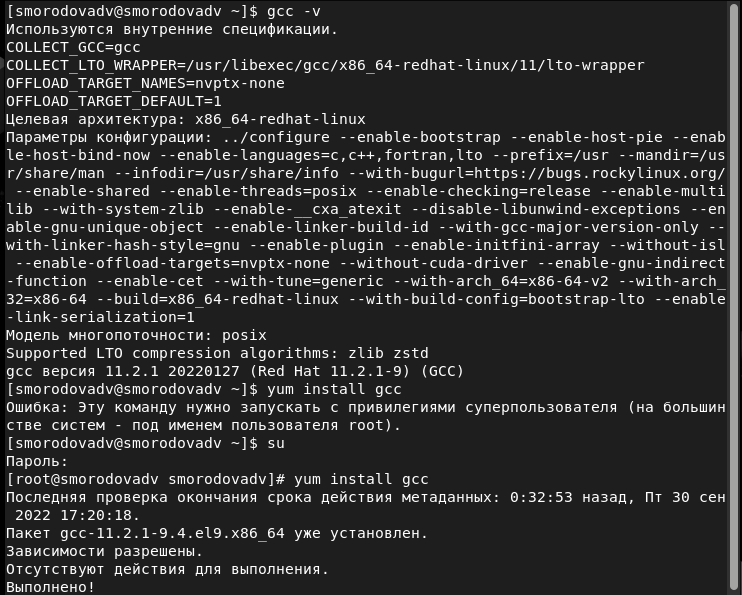{ #fig:001 width=70% }

## Отключение системы запретов

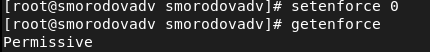{ #fig:002 width=70% }

## Проверка компиляторов

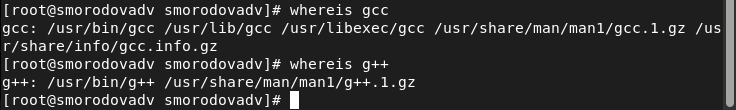{ #fig:003 width=70% }

## Содержимое файла simpleid.c

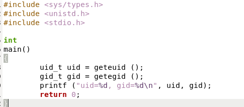{ #fig:005 width=70% }

## Компиляция и запуск файла simpleid.c

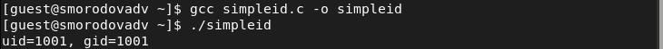{ #fig:006 width=70% }

## Команда id

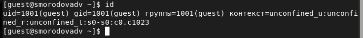{ #fig:007 width=70% }

## Содержимое файла simpleid2.c

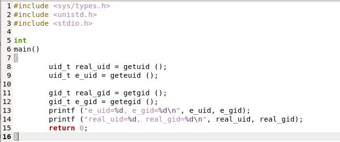{ #fig:008 width=70% }

## Компиляция и запуск файла simpleid2.c

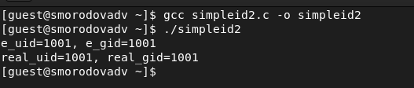{ #fig:009 width=70% }

## Команды chown и chmod

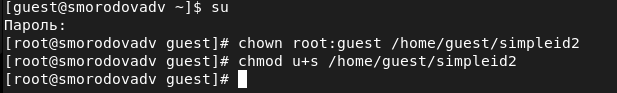{ #fig:010 width=70% }

## Проверка правильности установки новых атрибутов

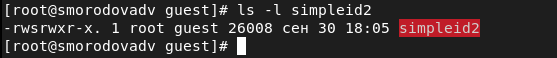{ #fig:011 width=70% }

## Запуск simpleid2 и id

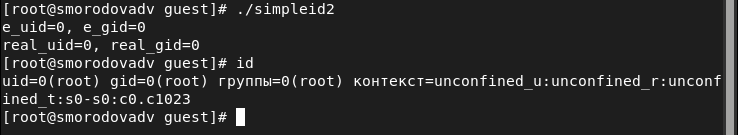{ #fig:012 width=70% }

## Сравнение SetGID-бита

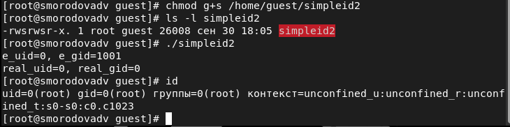{ #fig:013 width=70% }

## Содержание файла readfile.c

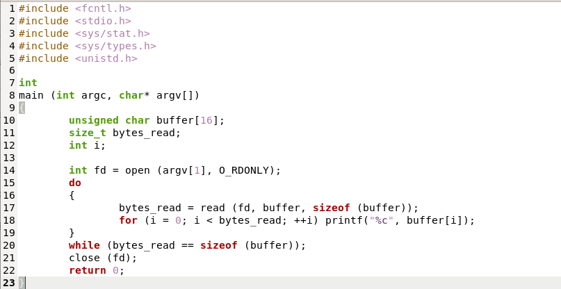{ #fig:014 width=70% }

## Компиляция файла readfile.c

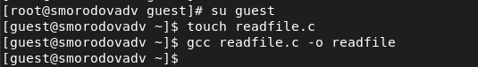{ #fig:015 width=70% }

## Смена владельца и прав у файла readfile.c 

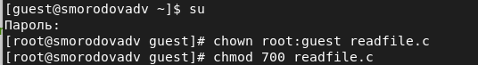{ #fig:016 width=70% }

## Проверка возможности прочитать файл readfile.c  

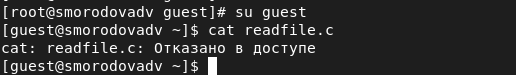{ #fig:017 width=70% }

## Смена у программы readfile владельца и установка SetU’D-бит 

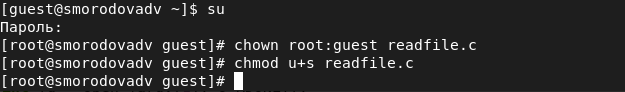{ #fig:018 width=70% }

## Проверка возможности прочитать файл readfile.c

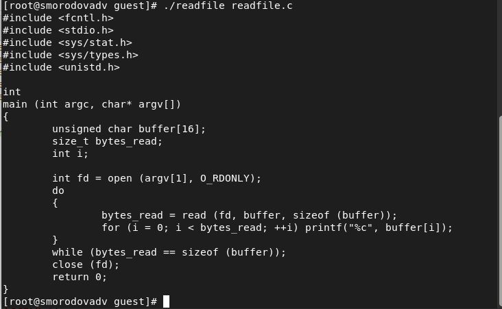{ #fig:019 width=70% }

## Проверка возможности прочитать файл /etc/shadow 

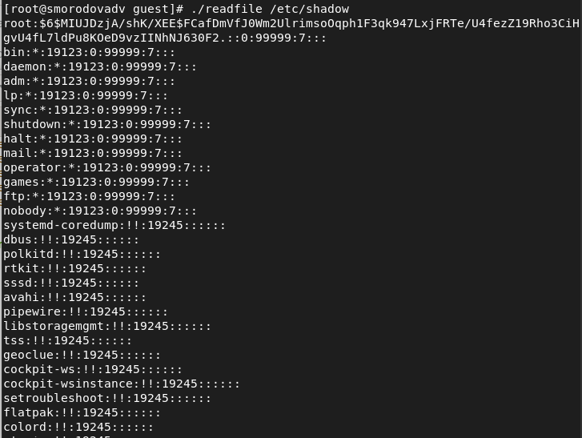{ #fig:020 width=70% }

## Проверка установки атрибута Sticky на директории /tmp

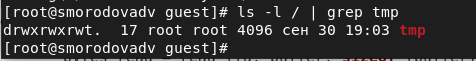{ #fig:021 width=70% }

## Создание файла file01.txt в директории /tmp со словом test 

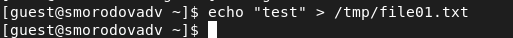{ #fig:022 width=70% }

## Просмотр атрибутов и разрешение чтения и записи для категории пользователей «все остальные»  

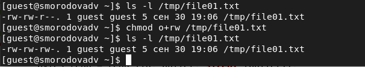{ #fig:023 width=70% }

## Попытка прочитать файл /tmp/file01.txt от пользователя guest2 

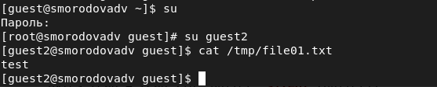{ #fig:024 width=70% }

## Попытка дозаписать в файл /tmp/file01.txt слово test2 от пользователя guest2  

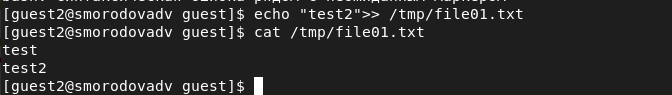{ #fig:025 width=70% }

## Попытка перезаписать файл /tmp/file01.txt словом test3 от пользователя guest2 

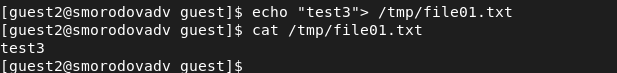{ #fig:026 width=70% }

## Попытка удалить файл /tmp/file01.txt от пользователя guest2 

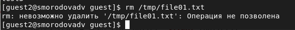{ #fig:027 width=70% }

## Снятие атрибута t с директории /tmp 

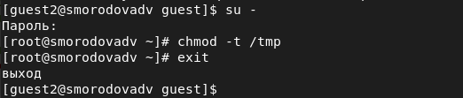{ #fig:028 width=70% }

## Проверка снятия атрибута t с директории /tmp

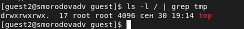{ #fig:029 width=70% }

## Повтор предыдущих шагов

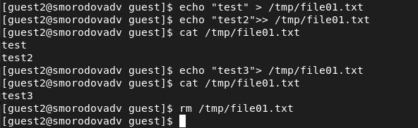{ #fig:030 width=70% }

## Возвращение атрибута t директории /tmp

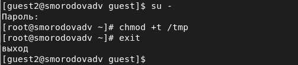{ #fig:031 width=70% }

# Выводы   

-  Изучили механизмы изменения идентификаторов, применения SetUID- и Sticky-битов;

- Получили практические навыки работы в консоли с дополнительными атрибутами;

- Рассмотрели работу механизма смены идентификатора процессов пользователей и влияние бита Sticky на запись и удаление файлов.
