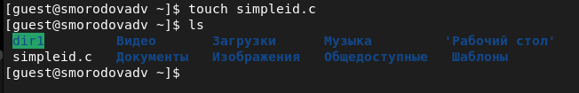

---
# Front matter
title: "Лабораторная работа №5"
subtitle: "Дискреционное разграничение прав в Linux. Исследование влияния дополнительных атрибутов"
author: "Смородова Дарья Владимировна"
group: НФИбд-01-19
institute: RUDN University, Moscow, Russian Federation
date: 2022 Oct 8th

# Generic otions
lang: ru-RU
toc-title: "Содержание"

# Bibliography
bibliography: bib/cite.bib
csl: pandoc/csl/gost-r-7-0-5-2008-numeric.csl

# Pdf output format
toc: true # Table of contents
toc_depth: 2
lof: true # List of figures
lot: true # List of tables
fontsize: 12pt
linestretch: 1.5
papersize: a4
documentclass: scrreprt
### Fonts
mainfont: PT Serif
romanfont: PT Serif
sansfont: PT Sans
monofont: PT Mono
mainfontoptions: Ligatures=TeX
romanfontoptions: Ligatures=TeX
sansfontoptions: Ligatures=TeX,Scale=MatchLowercase
monofontoptions: Scale=MatchLowercase,Scale=0.9
## Biblatex
biblatex: true
biblio-style: "gost-numeric"
biblatexoptions:
- parentracker=true
- backend=biber
- hyperref=auto
- language=auto
- autolang=other*
- citestyle=gost-numeric
## Misc options
indent: true
header-includes:
- \linepenalty=10 # the penalty added to the badness of each line within a paragraph (no associated penalty node) Increasing the value makes tex try to have fewer lines in the paragraph.
- \interlinepenalty=0 # value of the penalty (node) added after each line of a paragraph.
- \hyphenpenalty=50 # the penalty for line breaking at an automatically inserted hyphen
- \exhyphenpenalty=50 # the penalty for line breaking at an explicit hyphen
- \binoppenalty=700 # the penalty for breaking a line at a binary operator
- \relpenalty=500 # the penalty for breaking a line at a relation
- \clubpenalty=150 # extra penalty for breaking after first line of a paragraph
- \widowpenalty=150 # extra penalty for breaking before last line of a paragraph
- \displaywidowpenalty=50 # extra penalty for breaking before last line before a display math
- \brokenpenalty=100 # extra penalty for page breaking after a hyphenated line
- \predisplaypenalty=10000 # penalty for breaking before a display
- \postdisplaypenalty=0 # penalty for breaking after a display
- \floatingpenalty = 20000 # penalty for splitting an insertion (can only be split footnote in standard LaTeX)
- \raggedbottom # or \flushbottom
- \usepackage{float} # keep figures where there are in the text
- \floatplacement{figure}{H} # keep figures where there are in the text
---

# Цель работы

Изучение механизмов изменения идентификаторов, применения SetUID- и Sticky-битов. Получение практических навыков работы в консоли с дополнительными атрибутами. Рассмотрение работы механизма смены идентификатора процессов пользователей, а также влияние бита Sticky на запись и удаление файлов.

# Теоретическое введение  

Компиляторы, доступные в Linux-системах, являются частью коллекции GNU-компиляторов, известной как GCC (GNU Compiller Collection, подробнее см. http://gcc.gnu.org). В неё входят компиляторы языков С, С++, Java, Objective-C, Fortran и Chill. Будем использовать лишь первые два.

Компилятор языка С называется gcc. Компилятор языка С++ называется g++ и запускается с параметрами почти так же, как gcc. Проверить это можно следующими командами: whereis gcc и whereis g++

Первый шаг заключается в превращении исходных файлов в объектный код: gcc -c file.с

В случае успешного выполнения команды (отсутствие ошибок в коде) полученный объектный файл будет называться file.о.

Объектные файлы невозможно запускать и использовать, поэтому после компиляции для получения готовой программы объектные файлы необходимо скомпоновать. Компоновать можно один или несколько файлов. В случае использования хотя бы одного из файлов, написанных на С++, компоновка производится с помощью компилятора g++. Строго говоря, это тоже не вполне верно. Компоновка объектного кода, сгенерированного чем бы то ни было (хоть вручную), производится линкером ld, g++ его просто вызывает изнутри. Если же все файлы написаны на языке С, нужно использовать компилятор gcc.

Например, так: gcc -o program file.o

В случае успешного выполнения команды будет создана программа program (исполняемый файл формата ELF с установленным атрибутом +х). 

Компилирование — это процесс. Компилятор gcc (g++) имеет множество параметров, влияющих на процесс компиляции. Он поддерживает различные режимы оптимизации, выбор платформы назначения и пр.

Также возможно использование make-файлов (Makefile) с помощью утилиты make для упрощения процесса компиляции.

Такое решение подойдёт лишь для простых случаев. Если говорить про пример выше, то компилирование одного файла из двух шагов можно сократить вообще до одного, например: gcc file.c

В этом случае готовая программа будет иметь называние a.out.

Механизм компилирования программ в данной работе не мог быть не рассмотрен потому, что использование программ, написанных на bash, для изучения SetUID- и SetGID- битов, не представляется возможным. Связано это с тем, что любая bash-программа интерпретируется в процессе своего выполнения, т.е. существует сторонняя программа-интерпретатор, которая выполняет считывание файла сценария и выполняет его последовательно. Сам интерпретатор выполняется с правами пользователя, его запустившего, а значит, и выполняемая программа использует эти права.

При этом интерпретатору абсолютно всё равно, установлены SetUID-, SetGID-биты у текстового файла сценария, атрибут разрешения запуска «x» или нет. Важно, чтобы был установлен лишь атрибут, разрешающий чтение «r».

Также не важно, был ли вызван интерпретатор из командной строки (запуск файла, как bash file1.sh), либо внутри файла была указана строчка #!/bin/bash.

Логично спросить: если установление SetUID- и SetGID- битов на сценарий не приводит к нужному результату как с исполняемыми файлами, то что мешает установить эти биты на сам интерпретатор? Ничего не мешает, только их установление приведёт к тому, что, так как владельцем /bin/bash является root: ls -l /bin/bash все сценарии, выполняемые с использованием /bin/bash, будут иметь возможности суперпользователя — совсем не тот результат, который хотелось бы видеть. [^1]

# Выполнение лабораторной работы [^1]

1. При помощи команды gcc -v проверим, установлен ли компилятор gcc (рис. [-@fig:001]):

{ #fig:001 width=70% }

2. При помощи команд setenforce 0 и getenforce отключим систему запретов до очередной перезагрузки системы (рис. [-@fig:002]):

{ #fig:002 width=70% }

3. Проверим компиляторы языков С++ и С командами whereis gcc и whereis g++ (рис. [-@fig:003]):

{ #fig:003 width=70% }

4. Войдем в систему от имени пользователя guest и создадим программу simpleid.c (рис. [-@fig:004] - [-@fig:005]):

{ #fig:004 width=70% }

{ #fig:005 width=70% }

5. Скомплилируем программу и убедимся, что файл программы создан, а затем выполним программу simpleid (рис. [-@fig:006]):

{ #fig:006 width=70% }

6. Выполните системную программу id. Результат вывода этой команды совпадает с выводом программы  simpleid (рис. [-@fig:007]):

{ #fig:007 width=70% }

7. Усложним программу, добавив вывод действительных идентификаторов (рис. [-@fig:008]):

{ #fig:008 width=70% }

8. Скомпилируем и запустим simpleid2.c (рис. [-@fig:009]):

{ #fig:009 width=70% }

9. От имени суперпользователя выполним команды chown root:guest /home/guest/simpleid2 и chmod u+s /home/guest/simpleid2 (рис. [-@fig:010]):

{ #fig:010 width=70% }

10. Выполним проверку правильности установки новых атрибутов и смены
владельца файла simpleid2 командой ls -l simpleid2 (рис. [-@fig:011]):

{ #fig:011 width=70% }

11. Запустим simpleid2 и id. Вывод в обоих случаях совпал (рис. [-@fig:012]):

{ #fig:012 width=70% }

12. Проделаем тоже самое относительно SetGID-бита (рис. [-@fig:013]):

{ #fig:013 width=70% }

13. Создайте программу readfile.c (рис. [-@fig:014]):

{ #fig:014 width=70% }

14. Компиляция файла readfile.c (рис. [-@fig:015]):

{ #fig:015 width=70% }

15. Сменим владельца у файла readfile.c (или любого другого текстового файла в системе) и изменим права так, чтобы только суперпользователь (root) мог прочитать его, a guest не мог (рис. [-@fig:016]):

{ #fig:016 width=70% }

16. Проверим, что пользователь guest не может прочитать файл readfile.c (рис. [-@fig:017]):

{ #fig:017 width=70% }

17. Сменим у программы readfile владельца и установим SetU’D-бит (рис. [-@fig:018]):

{ #fig:018 width=70% }

18. Проверим, может ли программа readfile прочитать файл readfile.c  (рис. [-@fig:019]):

{ #fig:019 width=70% }

19. Проверим, может ли программа readfile прочитать файл /etc/shadow (рис. [-@fig:020]):

{ #fig:020 width=70% }

20. Выясним, установлен ли атрибут Sticky на директории /tmp командой ls -l / | grep tmp (рис. [-@fig:021]):

{ #fig:021 width=70% }

21. От имени пользователя guest создадим файл file01.txt в директории /tmp со словом test (рис. [-@fig:022]):

{ #fig:022 width=70% }

22. Просмотрим атрибуты у только что созданного файла и разрешим чтение и запись для категории пользователей «все остальные» (рис. [-@fig:023]):

{ #fig:023 width=70% }

23. От пользователя guest2 (не являющегося владельцем) попробуем прочитать файл /tmp/file01.txt (рис. [-@fig:024]):

{ #fig:024 width=70% }

24. От пользователя guest2 попробуем дозаписать в файл /tmp/file01.txt слово test2. Это получилось сделать. Проверим содержимое файла (рис. [-@fig:025]):

{ #fig:025 width=70% }

25. От пользователя guest2 попробуем записать в файл /tmp/file01.txt
слово test3, стерев при этом всю имеющуюся в файле информацию  и проверим содержимое файла (рис. [-@fig:026]):

{ #fig:026 width=70% }

26. От пользователя guest2 попробуем удалить файл /tmp/file01.txt командой rm /tmp/fileOl.txt, это сделать не удалось (рис. [-@fig:027]):

{ #fig:027 width=70% }

27. Повысим свои права до суперпользователя командой su - и выполним после этого команду, снимающую атрибут t (Sticky-бит) с директории /tmp командой chmod -t /tmp. Покинем режим суперпользователя командой
exit (рис. [-@fig:028]):

{ #fig:028 width=70% }

28. От пользователя guest2 проверим, что атрибута t у директории /tmp
нет (рис. [-@fig:029]):

{ #fig:029 width=70% }

29. Повторим предудущие шаги, и увидим, что теперь мы можем не только добавлять текст  файл, перезаписывать его и показывать содержимое, но и удалять файл (рис. [-@fig:030]):

{ #fig:030 width=70% }

30. Повысим свои права до суперпользователя и вернем атрибут t на директорию /tmp (рис. [-@fig:031]):

{ #fig:031 width=70% }

# Выводы  
В ходе данной лабораторной работы, мы изучили механизмы изменения идентификаторов, применения SetUID- и Sticky-битов, получили практические навыки работы в консоли с дополнительными атрибутами, а также рассмотрели работу механизма смены идентификатора процессов пользователей и влияние бита Sticky на запись и удаление файлов.

# Список литературы

1. [Методические материалы к лабораторной работе, представленные на сайте "ТУИС РУДН"](https://esystem.rudn.ru/)

[^1]: Методические материалы к лабораторной работе
