---
# Front matter
lang: ru-RU
title: Защита лабораторной работы №6.Мандатное разграничение прав в Linux
author: "Смородова Дарья Владимировна"
group: НФИбд-01-19
institute: RUDN University, Moscow, Russian Federation
date: 2022  Oct 15th

# Formatting
toc: false
slide_level: 2
theme: metropolis
header-includes: 
 - \metroset{progressbar=frametitle,sectionpage=progressbar,numbering=fraction}
 - '\makeatletter'
 - '\beamer@ignorenonframefalse'
 - '\makeatother'
aspectratio: 43
section-titles: true

---

# Цель выполнения лабораторной работы 

- Развить навыки администрирования ОС Linux;

- Получить первое практическое знакомство с технологией SELinux1;

- Проверить работу SELinx на практике совместно с веб-сервером Apache.

# Результаты выполнения лабораторной работы

## Задание параметра ServerName  

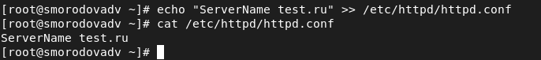{ #fig:001 width=70% }

## Отключение фильтра] 

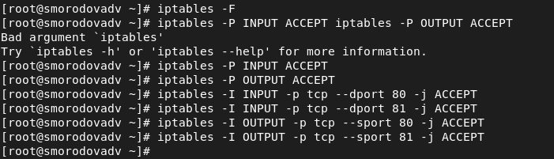{ #fig:002 width=70% height=70% }

## Проверка режима и политики

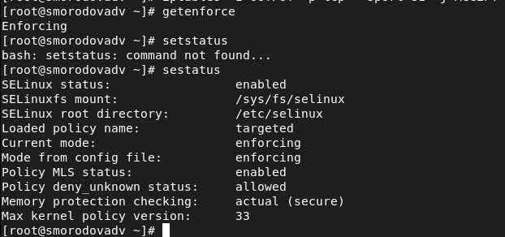{ #fig:003 width=70% height=70% }

## Проверка статуса

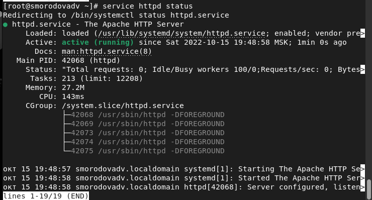{ #fig:004 width=70% height=70% }

## Веб-сервер Apache

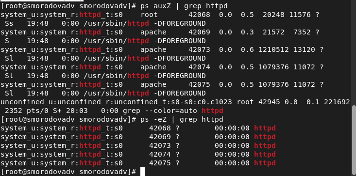{ #fig:005 width=70% height=70% }

## Просмотр переключателей SELinux для Apache

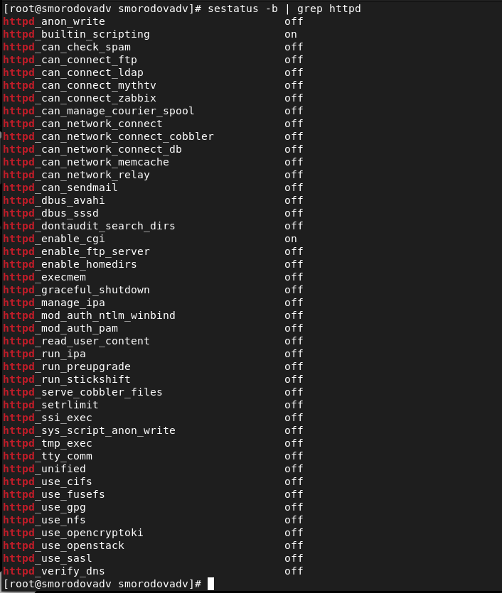{ #fig:006 width=70% height=70% }

## Статистика по политике

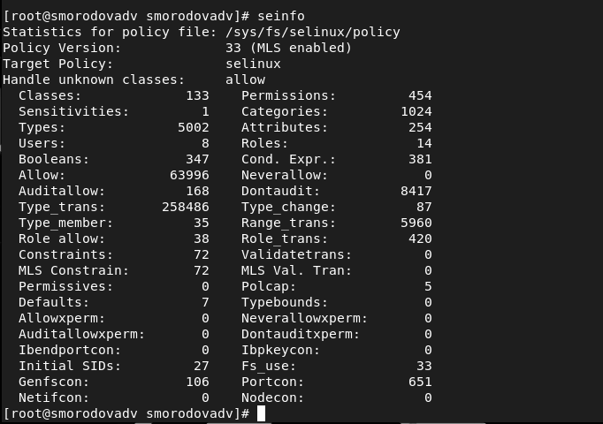{ #fig:007 width=70% height=70% }

## Определение типов файлов и поддиректорий в директории /var/www

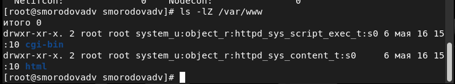{ #fig:008 width=70% height=70% }

## Определение типов файлов  в директории /var/www/html

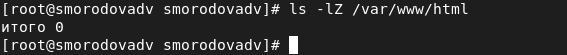{ #fig:009 width=70% height=70% }

## Создание файла

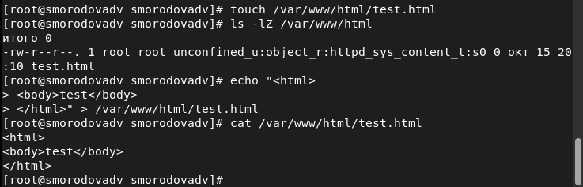{ #fig:010 width=70% height=70% }

## Проверка контекста

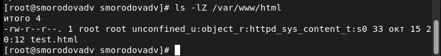{ #fig:011 width=70% height=70% }

## Получение доступа к файлу через браузер

{ #fig:012  width=70% height=70%}

## Проверка контекста файла

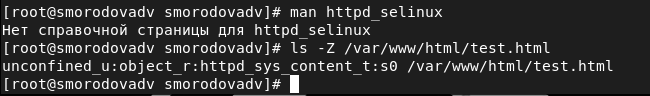{ #fig:013  width=70% height=70% }

## Изменение контекста файла /var/www/html/test.html

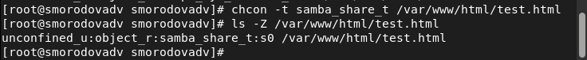{ #fig:014  width=70% height=70% }

## Получение доступа к файлу через браузер

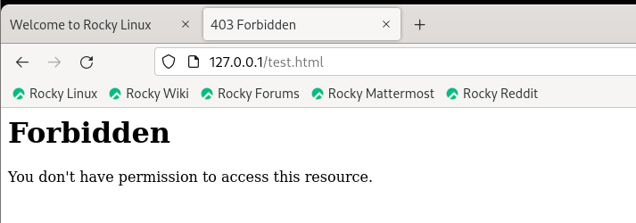{ #fig:015  width=70% height=70% }

## Просмотр log-файла веб-сервера Apache

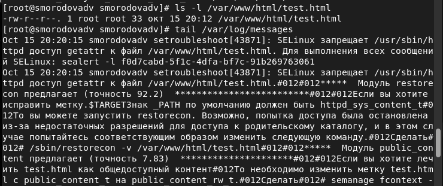{ #fig:016  width=70% height=70%}

## Изменеие ТСР-порта с 80 на 81

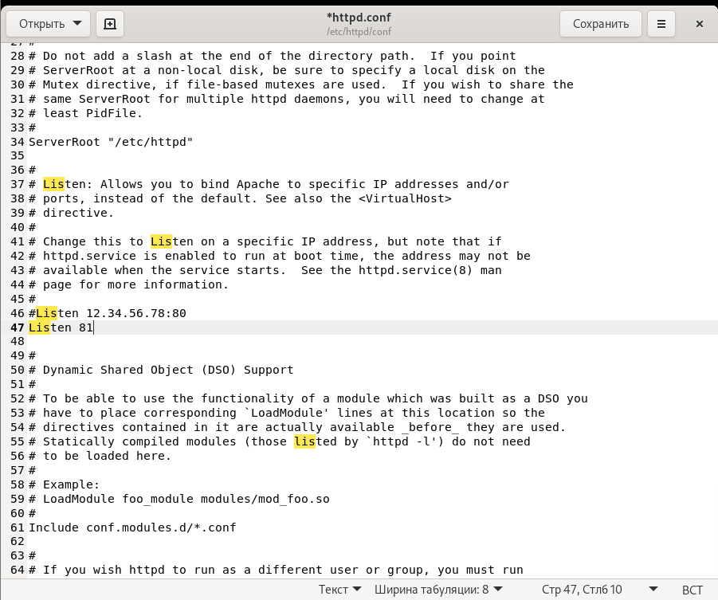{ #fig:017  width=70% height=70% }

## Анализ и просмотр лог-файлов  

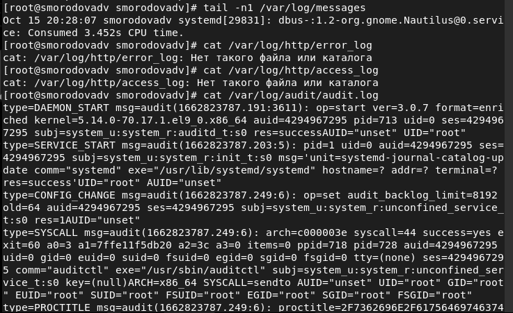{ #fig:018  width=70% height=70% }

## Выполнение и проверка списка портов 

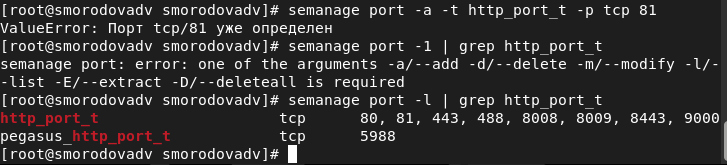{ #fig:019  width=70% height=70% }

## Возвращение контекста

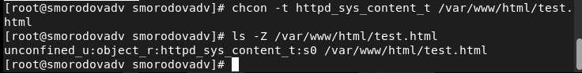{ #fig:020  width=70% height=70% }

## Получение доступа к файлу через браузер

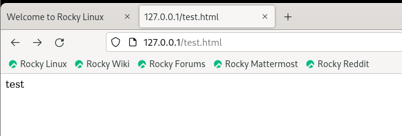{ #fig:021  width=70% height=70% }

## Исправленный файл apache

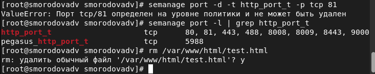{ #fig:022 width=70% height=70% }

## Удаление привязки к 81 порту и удаление файла 

{ #fig:023 width=70% height=70% }

# Выводы   

- Развили навыки администрирования ОС Linux;

- Получили первое практическое знакомство с технологией SELinux1;

- Проверили работу SELinx на практике совместно с веб-сервером Apache.
