---
# Front matter
title: "Отчет по лабораторной работе №6"
subtitle: "Мандатное разграничение прав в Linux"
author: "Смородова Дарья Владимировна"
group: NFIbd-01-19
institute: RUDN University, Moscow, Russian Federation
date: 2022 Oct 15th

# Generic otions
lang: ru-RU
toc-title: "Содержание"

# Bibliography
bibliography: bib/cite.bib
csl: pandoc/csl/gost-r-7-0-5-2008-numeric.csl

# Pdf output format
toc: true # Table of contents
toc_depth: 2
lof: true # List of figures
lot: true # List of tables
fontsize: 12pt
linestretch: 1.5
papersize: a4
documentclass: scrreprt
### Fonts
mainfont: PT Serif
romanfont: PT Serif
sansfont: PT Sans
monofont: PT Mono
mainfontoptions: Ligatures=TeX
romanfontoptions: Ligatures=TeX
sansfontoptions: Ligatures=TeX,Scale=MatchLowercase
monofontoptions: Scale=MatchLowercase,Scale=0.9
## Biblatex
biblatex: true
biblio-style: "gost-numeric"
biblatexoptions:
- parentracker=true
- backend=biber
- hyperref=auto
- language=auto
- autolang=other*
- citestyle=gost-numeric
## Misc options
indent: true
header-includes:
- \linepenalty=10 # the penalty added to the badness of each line within a paragraph (no associated penalty node) Increasing the value makes tex try to have fewer lines in the paragraph.
- \interlinepenalty=0 # value of the penalty (node) added after each line of a paragraph.
- \hyphenpenalty=50 # the penalty for line breaking at an automatically inserted hyphen
- \exhyphenpenalty=50 # the penalty for line breaking at an explicit hyphen
- \binoppenalty=700 # the penalty for breaking a line at a binary operator
- \relpenalty=500 # the penalty for breaking a line at a relation
- \clubpenalty=150 # extra penalty for breaking after first line of a paragraph
- \widowpenalty=150 # extra penalty for breaking before last line of a paragraph
- \displaywidowpenalty=50 # extra penalty for breaking before last line before a display math
- \brokenpenalty=100 # extra penalty for page breaking after a hyphenated line
- \predisplaypenalty=10000 # penalty for breaking before a display
- \postdisplaypenalty=0 # penalty for breaking after a display
- \floatingpenalty = 20000 # penalty for splitting an insertion (can only be split footnote in standard LaTeX)
- \raggedbottom # or \flushbottom
- \usepackage{float} # keep figures where there are in the text
- \floatplacement{figure}{H} # keep figures where there are in the text
---

# Цель работы

Развить навыки администрирования ОС Linux. Получить первое практическое знакомство с технологией SELinux1. Проверить работу SELinx на практике совместно с веб-сервером Apache.

# Теоретическое введение[^2]

Apache HTTP-сервер (является искажённым сокращением от англ. a patchy server; среди русских пользователей общепринято переводное апа́ч) — свободный веб-сервер.

Apache является кроссплатформенным ПО, поддерживает операционные системы Linux, BSD, macOS, Microsoft Windows, Novell NetWare, BeOS.

Основными достоинствами Apache считаются надёжность и гибкость конфигурации. Он позволяет подключать внешние модули для предоставления данных, использовать СУБД для аутентификации пользователей, модифицировать сообщения об ошибках и т. д. Поддерживает IPv4.

Сервер был написан в начале 1995 года и считается, что его имя восходит к шуточному названию «a patchy» (с англ. — «в заплатках»), так как он устранял ошибки популярного тогда сервера Всемирной паутины NCSA HTTPd 1.3. В дальнейшем, с версии 2.х, сервер был переписан заново и теперь не содержит кода NCSA. На данный момент разработка ведётся в ветке 2.4, а в версиях 1.3, 2.0 и 2.2 производятся лишь исправления ошибок безопасности. На текущий момент последняя версия ветки 2.4 — 2.4.46 (5 августа 2020), для первой версии это 1.3.42.

Веб-сервер Apache разрабатывается и поддерживается открытым сообществом разработчиков под эгидой Apache Software Foundation и включён во многие программные продукты, среди которых СУБД Oracle и IBM WebSphere.

# Выполнение лабораторной работы[^1]

1. В конфигурационном файле /etc/httpd/httpd.conf зададим параметр ServerName (рис. [-@fig:001]):

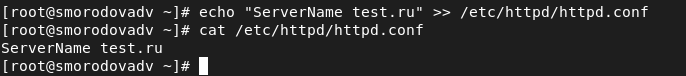{ #fig:001 width=70% }

2. Также проследим, чтобы пакетный фильтр был отключён или в своей рабочей конфигурации позволял подключаться к 80-у и 81-у портам протокола tcp. Отключим фильтр и добавим разрешающие правила (рис. [-@fig:002]):

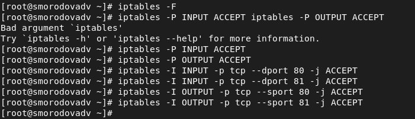{ #fig:002 width=70% height=70% }

3. Войдем в систему с полученными учётными данными и убедимся, что SELinux работает в режиме enforcing политики targeted (рис. [-@fig:003]):

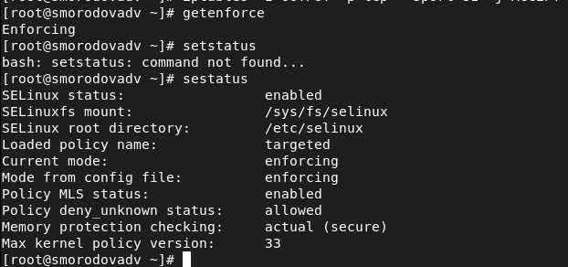{ #fig:003 width=70% height=70% }

4. Обратимся с помощью браузера к веб-серверу, запущенному на компьютере, и убедимся, что последний работает (рис. [-@fig:004]):

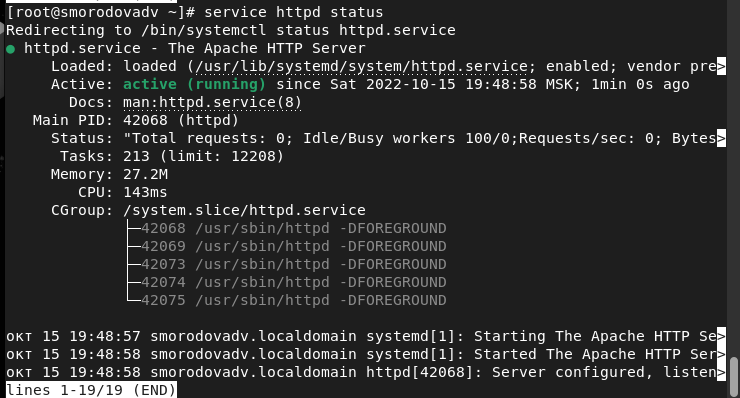{ #fig:004 width=70% height=70% }

5. Найдем веб-сервер Apache в списке процессов, определим его контекст безопасности (рис. [-@fig:005]):

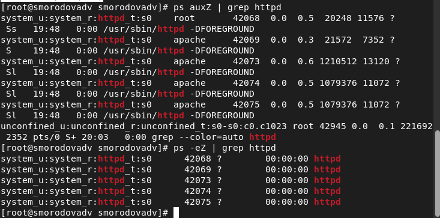{ #fig:005 width=70% height=70% }

6. Посмотрим текущее состояние переключателей SELinux для Apache (рис. [-@fig:006]):

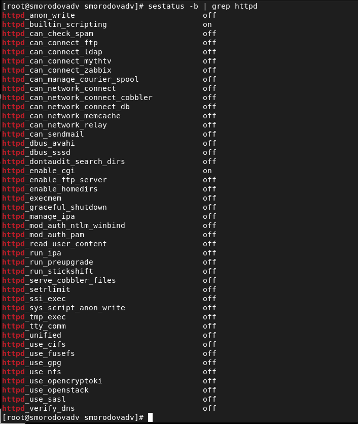{ #fig:006 width=70% height=70% }

7. Посмотрим статистику по политике, а также определим множество пользователей(8), ролей(14), типов(5002). (рис. [-@fig:007]):

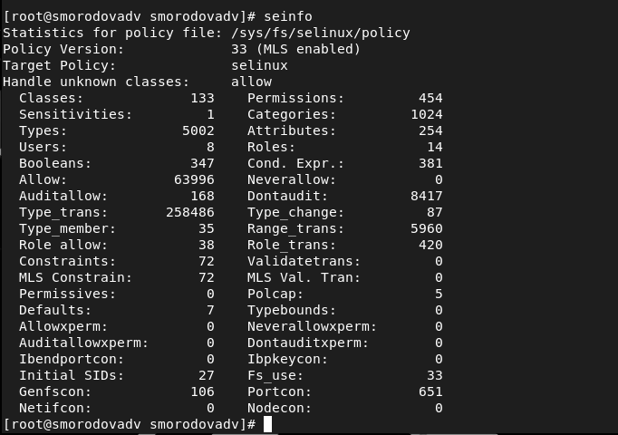{ #fig:007 width=70% height=70% }

8. Определим тип файлов и поддиректорий, находящихся в директории /var/www (рис. [-@fig:008]):

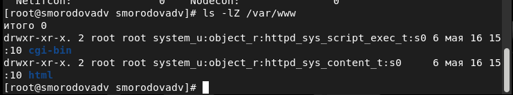{ #fig:008 width=70% height=70% }

9. Определим тип файлов, находящихся в директории /var/www/html и  круг пользователей, которым разрешено  создание файлов в директории /var/www/html (рис. [-@fig:009]):

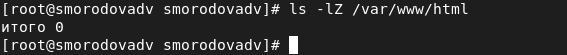{ #fig:009 width=70% height=70% }

10. Создадим от имени суперпользователя html-файл /var/www/html/test.html (рис. [-@fig:010]):

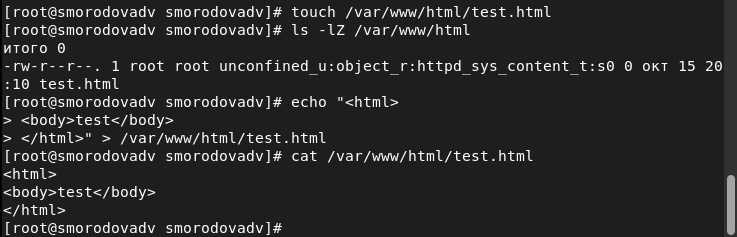{ #fig:010 width=70% height=70% }

11. Проверим контекст созданного файла: httpd_sys_content_t (рис. [-@fig:011]):

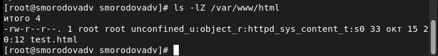{ #fig:011 width=70% height=70% }

12. Обратимся к файлу через веб-сервер, введя в браузере адрес http://127.0.0.1/test.html. Убедимся, что файл был успешно отображён (рис. [-@fig:012]):

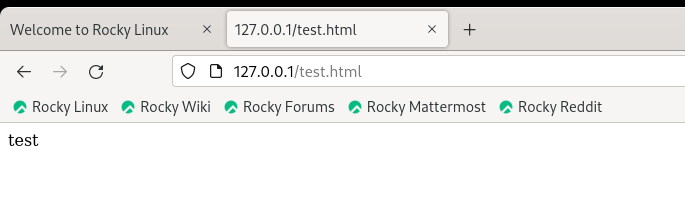{ #fig:012  width=70% height=70%}

13. Проверим контекст файла (рис. [-@fig:013]):

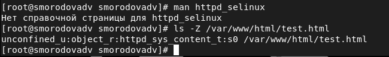{ #fig:013  width=70% height=70% }

14. Изменим контекст файла /var/www/html/test.html с httpd_sys_content_t на samba_share_t. После этого проверим, что контекст поменялся (рис. [-@fig:014]):

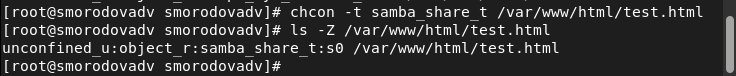{ #fig:014  width=70% height=70% }

15. Попробуем ещё раз получить доступ к файлу через веб-сервер, введя в браузере адрес http://127.0.0.1/test.html. Получим сообщение об ошибке, так как мы ранее изменили контекст файла(рис. [-@fig:015]):

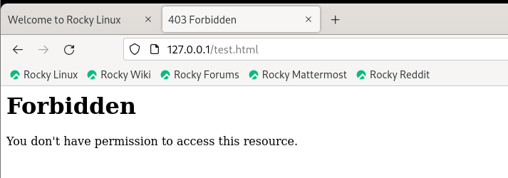{ #fig:015  width=70% height=70% }

16. Просмотрим log-файлы веб-сервера Apache. Также просмотрем системный лог-файл (рис. [-@fig:016]):

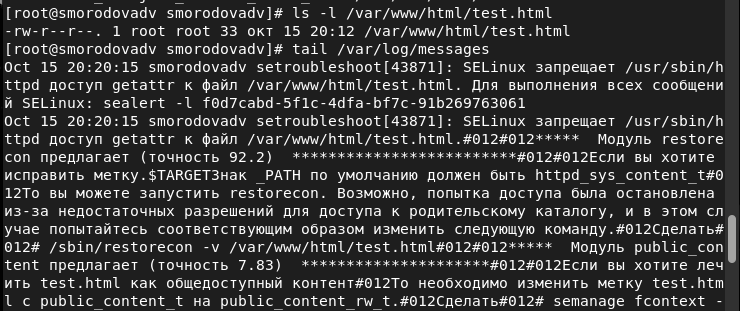{ #fig:016  width=70% height=70%}

17. Попробуем запустить веб-сервер Apache на прослушивание ТСР-порта 81 (а не 80, как рекомендует IANA и прописано в /etc/services). Для этого в файле /etc/httpd/httpd.conf найдем строчку Listen 80 и заменим её на Listen 81 (рис. [-@fig:017]):

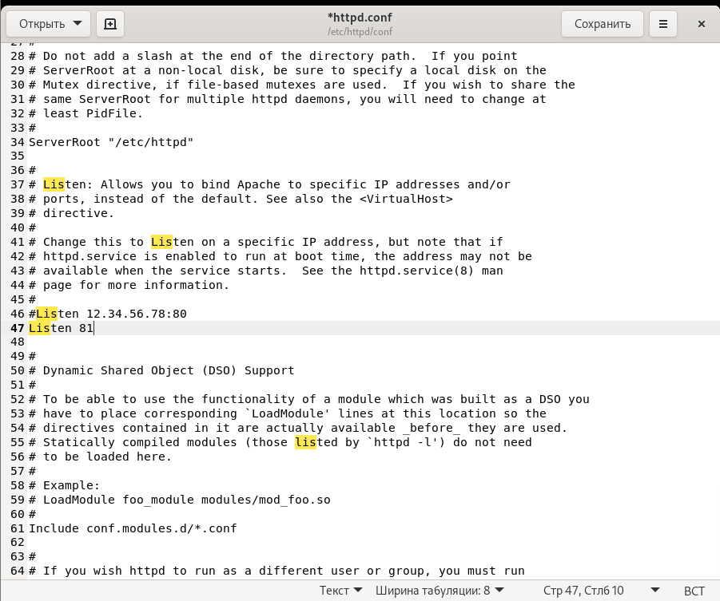{ #fig:017  width=70% height=70% }

18. Просмотрим файлы /var/log/http/error_log /var/log/http/access_log и /var/log/audit/audit.log (рис. [-@fig:018]):

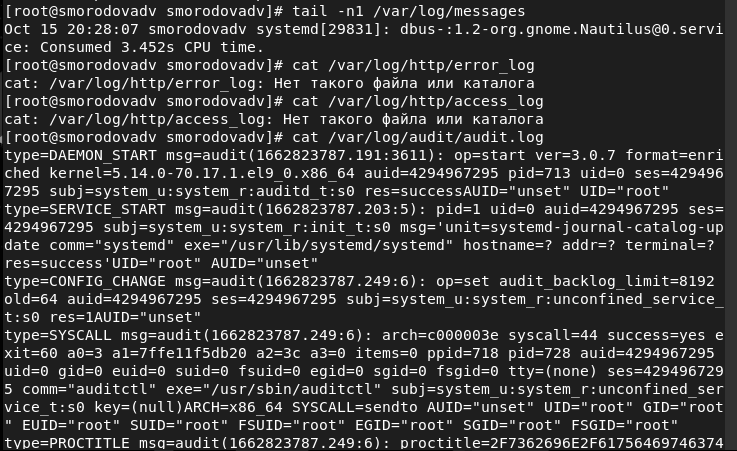{ #fig:018  width=70% height=70% }

19. Выполним команду semanage port -a -t http_port_t -р tcp 81. После этого проверим список портов. Убедимся, что порт 81 появился в списке (рис. [-@fig:019]):

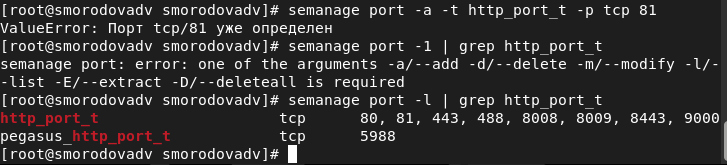{ #fig:019  width=70% height=70% }

20. Вернем контекст httpd_sys_cоntent__t к файлу /var/www/html/test.html (рис. [-@fig:020]):

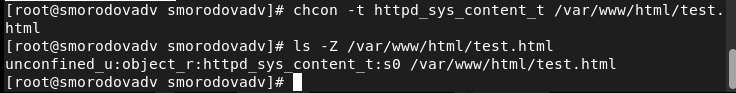{ #fig:020  width=70% height=70% }

21. Попробуем получить доступ к файлу через веб-сервер, введя в браузере адрес http://127.0.0.1:81/test.html. Снова увидим содержимое файла — слово «test» (рис. [-@fig:021]):

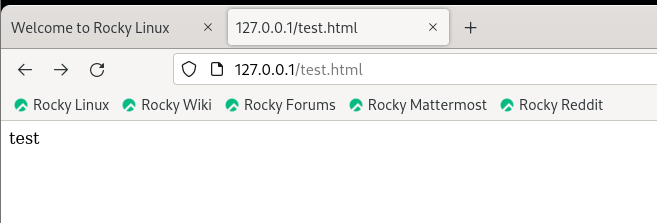{ #fig:021  width=70% height=70% }

22. Исправим обратно конфигурационный файл apache, вернув Listen80 (рис. [-@fig:022]):

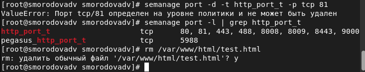{ #fig:022 width=70% height=70% }

23. Удалим привязку http_port_t к 81 порту и удалим файл /var/www/html/test.html (рис. [-@fig:023]):

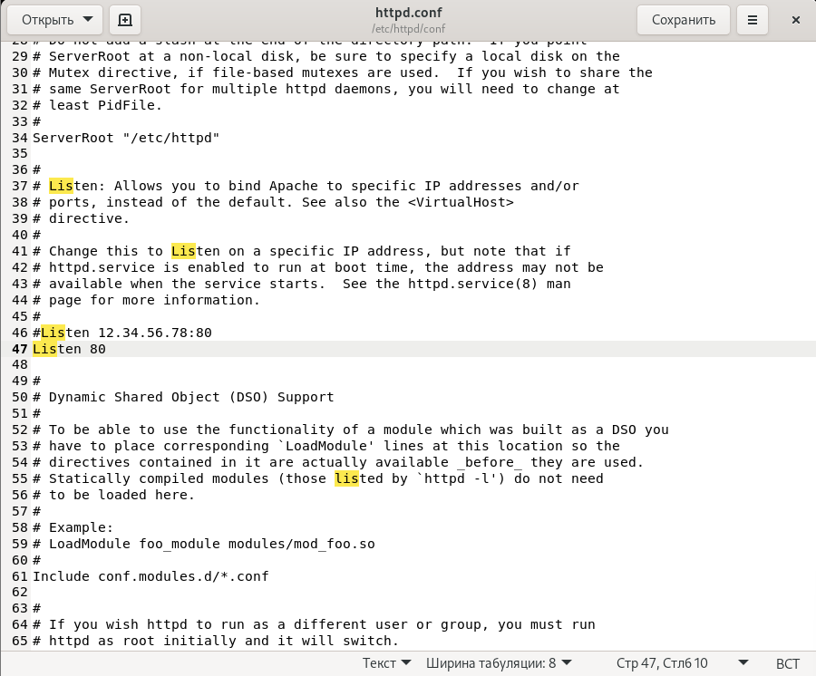{ #fig:023 width=70% height=70% }

# Выводы

В ходе выполнения данной лабораторной работы, мы развили навыки администрирования ОС Linux, получили первое практическое знакомство  с технологией SELinux и проверили работу SELinx на практике совместно с веб-сервером Apache.

# Список литературы

1. [Методические материалы к лабораторной работе, представленные на сайте "ТУИС РУДН"](https://esystem.rudn.ru/)

2. [Wikipedia. Apache HTTP Server](https://ru.wikipedia.org/wiki/Apache_HTTP_Server)

[^1]: Методические материалы к лабораторной работе

[^2]: Wikipedia. Apache HTTP Server

