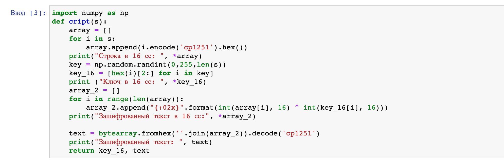
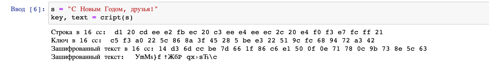
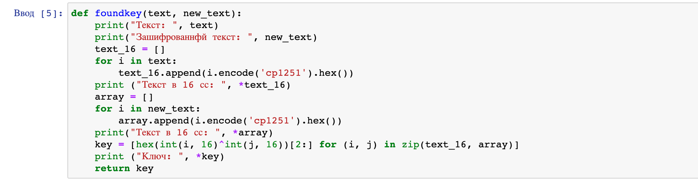
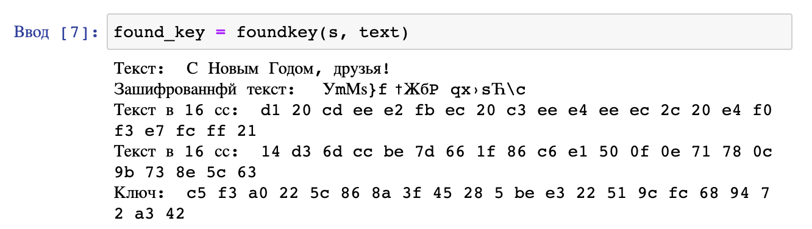
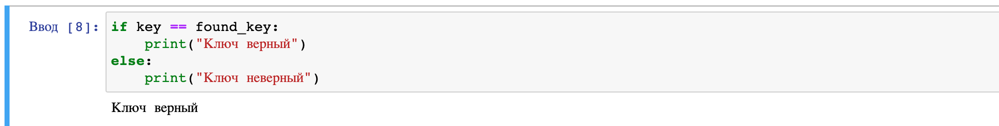

---
# Front matter
lang: ru-RU
title: Защита лабораторной работы №7. Элементы криптографии. Однократное гаммирование
author: "Смородова Дарья Владимировна"
group: НФИбд-01-19
institute: RUDN University, Moscow, Russian Federation
date: 2022 Oct 21th

# Formatting
toc: false
slide_level: 2
theme: metropolis
header-includes: 
 - \metroset{progressbar=frametitle,sectionpage=progressbar,numbering=fraction}
 - '\makeatletter'
 - '\beamer@ignorenonframefalse'
 - '\makeatother'
aspectratio: 43
section-titles: true

---

# Цель выполнения лабораторной работы 

Освоить на практике применение режима однократного гаммирования.

# Задание лаборатоной работы

Нужно подобрать ключ, чтобы получить сообщение «С Новым Годом,
друзья!». Требуется разработать приложение, позволяющее шифровать и
дешифровать данные в режиме однократного гаммирования. Приложение
должно:

1. Определить вид шифротекста при известном ключе и известном открытом тексте.

2. Определить ключ, с помощью которого шифротекст может быть преобразован в некоторый фрагмент текста, представляющий собой один из
возможных вариантов прочтения открытого текста.

# Теоретическое введение

Гаммирование представляет собой наложение (снятие) на открытые (зашифрованные) данные последовательности элементов других данных, полученной с помощью некоторого криптографического алгоритма, для получения зашифрованных (открытых) данных. Иными словами, наложение гаммы — это сложение её элементов с элементами открытого (закрытого)текста по некоторому фиксированному модулю, значение которого представляет собой известную часть алгоритма шифрования.

## Теоретическое введение

Наложение гаммы по сути представляет собой выполнение операции сложения по модулю 2 (XOR) (обозначаемая знаком $\oplus$) между элементами гаммы и элементами подлежащего сокрытию текста. Напомним, как работает операция XOR над битами: $0 \oplus 0 = 0, 0 \oplus 1 = 1, 1 \oplus 0 = 1, 1 \oplus 1 = 0$.

## Теоретическое введение

Если известны ключ и открытый текст, то задача нахождения шифротекста заключается в применении к каждому символу открытого текста следующего правила:

$C_i = P_i \oplus K_i$

## Теоретическое введение

Если известны шифротекст и открытый текст, то задача нахождения
ключа решается также, а именно, обе части равенства необходимо сложить по модулю 2 с $P_i$:

$C_i \oplus P_i = P_i \oplus K_i  \oplus P_i = K_i$

$K_i = C_i \oplus P_i$

# Результаты выполнения лабораторной работы

## Функция шифрования данных 

{ #fig:001 width=70% }

## Результат работы функции, шифрующей данные

{ #fig:002 width=70% }

## Функция, дешифрующая данные

{ #fig:003 width=70% }

## Результат работы функции, дешифрующей данные

{ #fig:004 width=70% }

## Сравнение ключей

{ #fig:005 width=70% }

# Выводы   

Освоили на практике применение режима однократного гаммирования.
