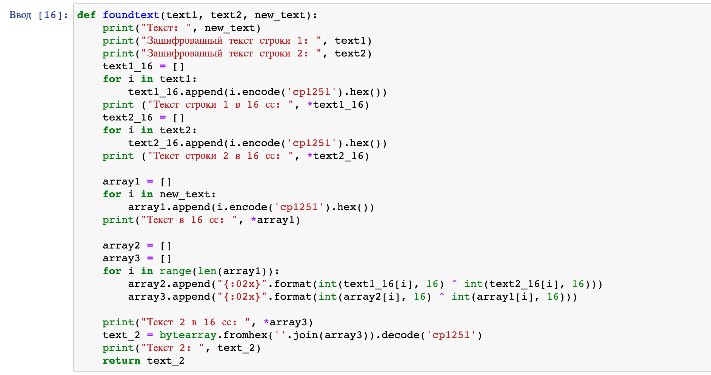

---
# Front matter
lang: ru-RU
title: Защита лабораторной работы №8. Шифрование (кодирование) различных исходных текстов одним ключом.
author: "Смородова Дарья Владимировна"
group: НФИбд-01-19
institute: RUDN University, Moscow, Russian Federation
date: 2022 Oct 29th

# Formatting
toc: false
slide_level: 2
theme: metropolis
header-includes: 
 - \metroset{progressbar=frametitle,sectionpage=progressbar,numbering=fraction}
 - '\makeatletter'
 - '\beamer@ignorenonframefalse'
 - '\makeatother'
aspectratio: 43
section-titles: true

---

# Цель выполнения лабораторной работы 

Освоить на практике применение режима однократного гаммирования на примере кодирования различных исходных текстов одним ключом.

# Задание лаборатоной работы

Два текста кодируются одним ключом (однократное гаммирование). Требуется не зная ключа и не стремясь его определить, прочитать оба текста. Необходимо разработать приложение, позволяющее шифровать и дешифровать тексты $P_1$ и $P_2$ в режиме однократного гаммирования. Приложение должно определить вид шифротекстов $C_1$ и $C_2$ обоих текстов $P_1$ и $P_2$ при известном ключе; Необходимо определить и выразить аналитически способ, при котором злоумышленник может прочитать оба текста, не зная ключа и не стремясь его определить.

# Результаты выполнения лабораторной работы

## Функция шифрования данных 

{ #fig:001 width=70% }

## Результат работы функции, шифрующей данные

{ #fig:002 width=70% }

## Функция, дешифрующая данные

{ #fig:003 width=70% }

## Результат работы функции, дешифрующей данные

{ #fig:004 width=70% }

# Выводы   

Освоили на практике применение режима однократного гаммирования на примере кодирования различных исходных текстов одним ключом.

