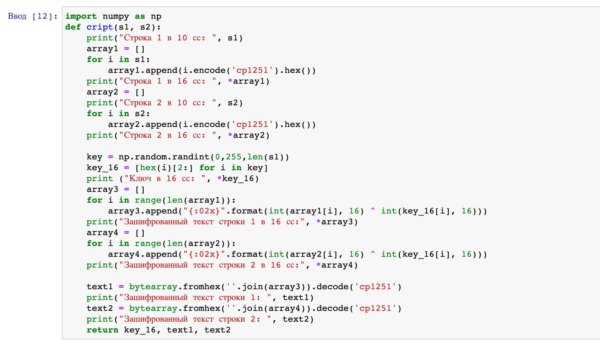
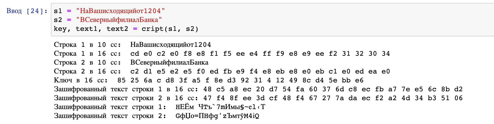
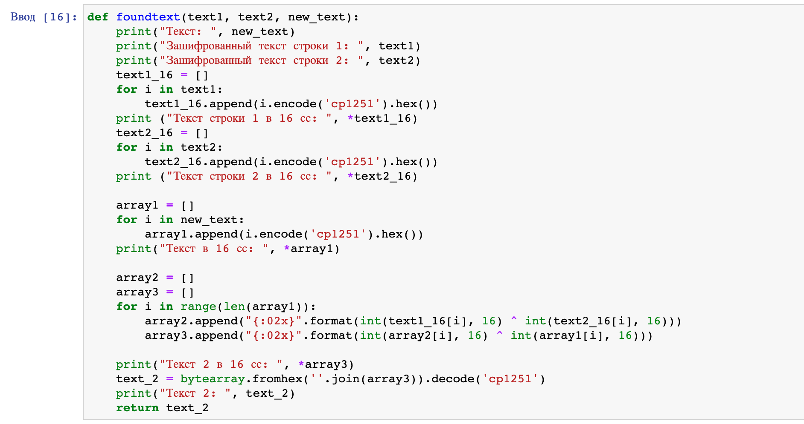
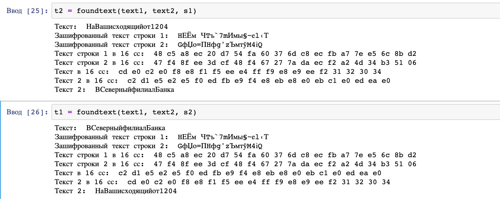

---
# Front matter
title: "Отчет по лабораторной работе №8"
subtitle: "Элементы криптографии. Шифрование (кодирование) различных исходных текстов одним ключом"
author: "Смородова Дарья Владимировна"
group: NFIbd-01-19
institute: RUDN University, Moscow, Russian Federation
date: 2022 Oct 29th

# Generic otions
lang: ru-RU
toc-title: "Содержание"

# Bibliography
bibliography: bib/cite.bib
csl: pandoc/csl/gost-r-7-0-5-2008-numeric.csl

# Pdf output format
toc: true # Table of contents
toc_depth: 2
lof: true # List of figures
lot: true # List of tables
fontsize: 12pt
linestretch: 1.5
papersize: a4
documentclass: scrreprt
### Fonts
mainfont: PT Serif
romanfont: PT Serif
sansfont: PT Sans
monofont: PT Mono
mainfontoptions: Ligatures=TeX
romanfontoptions: Ligatures=TeX
sansfontoptions: Ligatures=TeX,Scale=MatchLowercase
monofontoptions: Scale=MatchLowercase,Scale=0.9
## Biblatex
biblatex: true
biblio-style: "gost-numeric"
biblatexoptions:
- parentracker=true
- backend=biber
- hyperref=auto
- language=auto
- autolang=other*
- citestyle=gost-numeric
## Misc options
indent: true
header-includes:
- \linepenalty=10 # the penalty added to the badness of each line within a paragraph (no associated penalty node) Increasing the value makes tex try to have fewer lines in the paragraph.
- \interlinepenalty=0 # value of the penalty (node) added after each line of a paragraph.
- \hyphenpenalty=50 # the penalty for line breaking at an automatically inserted hyphen
- \exhyphenpenalty=50 # the penalty for line breaking at an explicit hyphen
- \binoppenalty=700 # the penalty for breaking a line at a binary operator
- \relpenalty=500 # the penalty for breaking a line at a relation
- \clubpenalty=150 # extra penalty for breaking after first line of a paragraph
- \widowpenalty=150 # extra penalty for breaking before last line of a paragraph
- \displaywidowpenalty=50 # extra penalty for breaking before last line before a display math
- \brokenpenalty=100 # extra penalty for page breaking after a hyphenated line
- \predisplaypenalty=10000 # penalty for breaking before a display
- \postdisplaypenalty=0 # penalty for breaking after a display
- \floatingpenalty = 20000 # penalty for splitting an insertion (can only be split footnote in standard LaTeX)
- \raggedbottom # or \flushbottom
- \usepackage{float} # keep figures where there are in the text
- \floatplacement{figure}{H} # keep figures where there are in the text
---

# Цель работы

Освоить на практике применение режима однократного гаммирования на примере кодирования различных исходных текстов одним ключом.

# Задание лаборатоной работы

Два текста кодируются одним ключом (однократное гаммирование). Требуется не зная ключа и не стремясь его определить, прочитать оба текста. Необходимо разработать приложение, позволяющее шифровать и дешифровать тексты $P_1$ и $P_2$ в режиме однократного гаммирования. Приложение должно определить вид шифротекстов $C_1$ и $C_2$ обоих текстов $P_1$ и $P_2$ при известном ключе; Необходимо определить и выразить аналитически способ, при котором злоумышленник может прочитать оба текста, не зная ключа и не стремясь его определить.

# Теоретическое введение[^1]

Исходные данные:
   Две телеграммы Центра:
   P1 = НаВашисходящийот1204
   P2 = ВСеверныйфилиалБанка
Ключ Центра длиной 20 байт:
   K = 05 0C 17 7F 0E 4E 37 D2 94 10 09 2E 22 57 FF C8 OB B2 70 54
Режим шифрования однократного гаммирования одним ключом двух видов открытого текста реализуется в соответствии со схемой ниже.

Шифротексты обеих телеграмм можно получить по формулам режима
однократного гаммирования:
$$C_1 = P_1 \oplus K$$

$$C_2 = P_2 \oplus K$$

Открытый текст можно найти, зная шифротекст двух телеграмм, зашифрованных одним ключом. Для это оба равенства складываются по модулю 2. Тогда с учётом свойства операции XOR:

$$1 \oplus 0 = 1, 1 \oplus 1 = 0$$

получаем:

$$C_1 \oplus C_2 = P_1 \oplus K  \oplus P_2 \oplus K = P_1 \oplus P_2 $$

Предположим, что одна из телеграмм является шаблоном — т.е. имеет текст фиксированный формат, в который вписываются значения полей. Допустим, что злоумышленнику этот формат известен. Тогда он получает достаточно много пар $C_1 \oplus C_2$ (известен вид обеих шифровок). Тогда зная $P_1$ и учитывая формулу выше, имеем:

$$C_1 \oplus C_2 \oplus P_1 = P_1 \oplus P_2 \oplus P_1 = P_2$$

Таким образом, злоумышленник получает возможность определить те символы сообщения $P_2$, которые находятся на позициях известного шаблона сообщения $P_1$. В соответствии с логикой сообщения $P_2$, злоумышленник имеет реальный шанс узнать ещё некоторое количество символов сообщения $P_2$. Затем вновь используется последняя формула с подстановкой вместо $P_1$ полученных на предыдущем шаге новых символов сообщения $P_2$. И так далее.

Действуя подобным образом, злоумышленник даже если не прочитает оба cообщения, то значительно уменьшит пространство их поиска.

# Выполнение лабораторной работы

1. Напишем на Python  функцию шифрования (рис. [-@fig:001]):

{ #fig:001 width=70% }

2. Посмотрим работу данной функции (рис. [-@fig:002]):

{ #fig:002 width=70% }

3. Напишем функцию дешифровки, которая возвращает вторую строку, получив на вход первую строку и обе защифрованные строки (рис. [-@fig:003]):

{ #fig:003 width=70% }

4. Посмторим на результаты функции дешифрования(рис. [-@fig:004]):

{ #fig:004 width=70% }

# Контрольные вопросы

1. Как, зная один из текстов (P1 или P2), определить другой, не зная при этом ключа?  

   Чтобы определить один из текстов, зная другой, необходимо вопсользоваться следующей формулой: $C_1 \oplus C_2 \oplus + P_1 = P_1 \oplus P_2 \oplus + P_1 = P_2$, где $C_1$ и $C_2$ - шифротексты. Т.е. ключ в данной формуле не используется.

2. Что будет при повторном использовании ключа при шифровании текста?  

   При повторном использовании ключа при шифровании текста получим исходное сообщение.

3. Как реализуется режим шифрования однократного гаммирования одним ключом двух открытых текстов?  

   Режим шифрования однократного гаммирования одним ключом двух открытых текстов реализуется по следующей формуле:
   $$C_1 = P_1 \oplus + K$$
   $$C_2 = P_2 \oplus + K,$$
   где $C_i$ - шифротексты, $P_i$ - открытые тексты, $K$ - единый
   ключ шифровки

4. Перечислите недостатки шифрования одним ключом двух открытых текстов.  

   Во-первых, имея на руках одно из сообщений в открытом виде и оба шифротекста, злоумышленник способен расшифровать каждое сообщение, не зная ключа.
   Во-вторых, зная шаблон сообщений, злоумышленник получает возможность определить те символы сообщения $P_2$, которые находятся на позициях известного шаблона сообщения $P_1$.

5. Перечислите преимущества шифрования одним ключом двух открытых текстов.  

   Такой подход помогает упростить процесс шифрования и дешифровки. Также, при отправке сообщений между 2-я компьютерами, удобнее пользоваться одним общим ключом для передаваемых данных

# Выводы

В ходе выполнения данной лабораторной работы, мы освоили на практике применение режима однократного гаммирования на примере кодирования различных исходных текстов одним ключом.

# Список литературы

1. [Методические материалы к лабораторной работе, представленные на сайте "ТУИС РУДН"](https://esystem.rudn.ru/)

[^1]: Методические материалы к лабораторной работе

